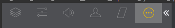
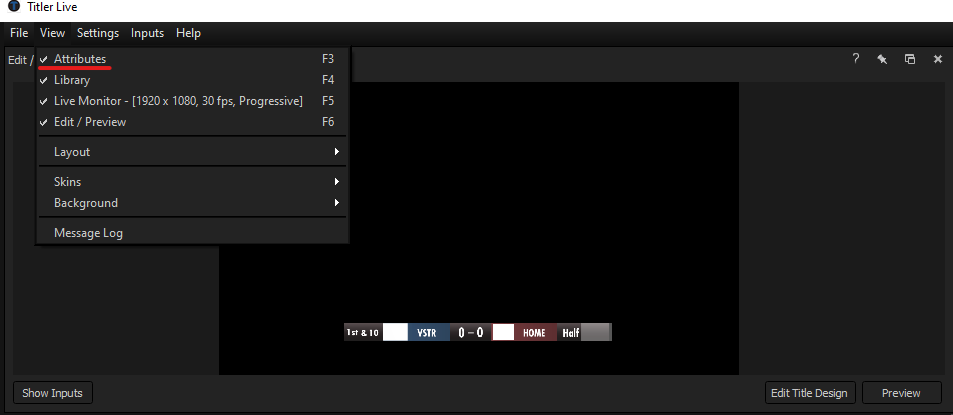
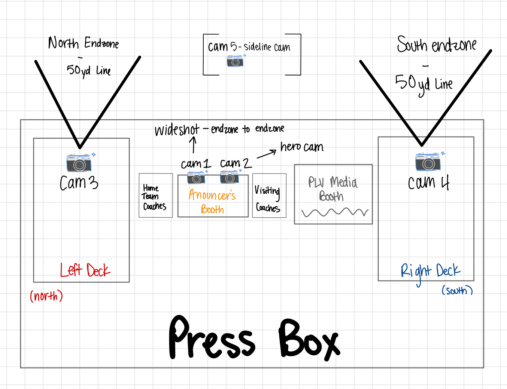
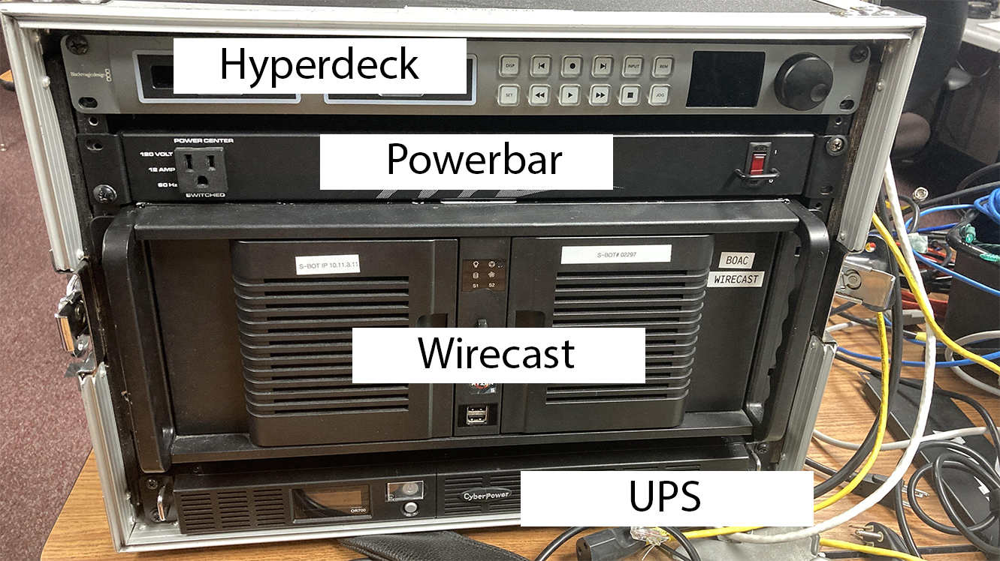
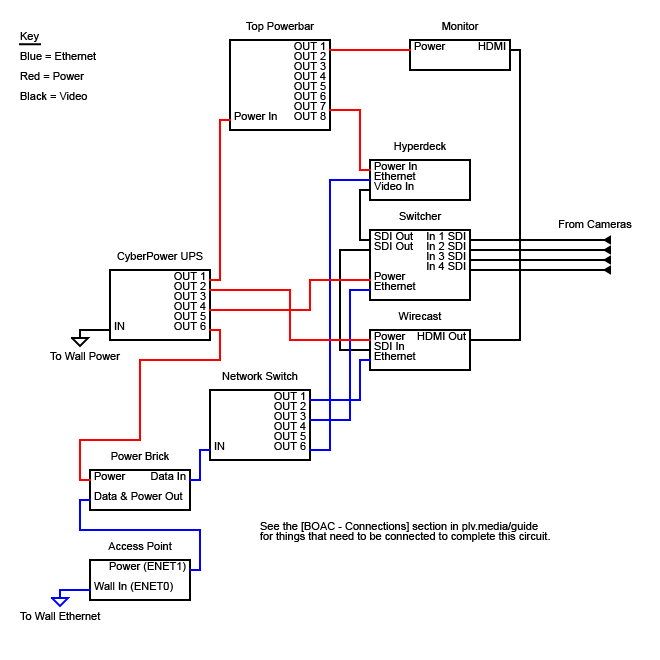
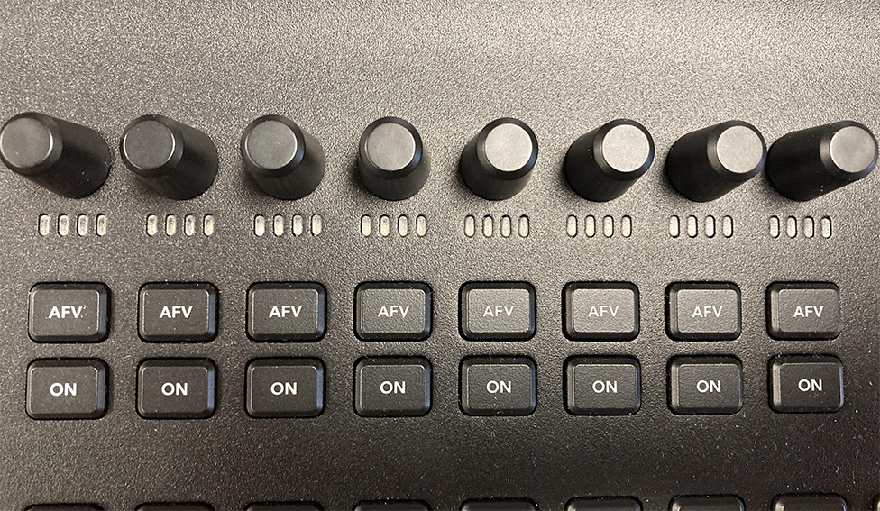
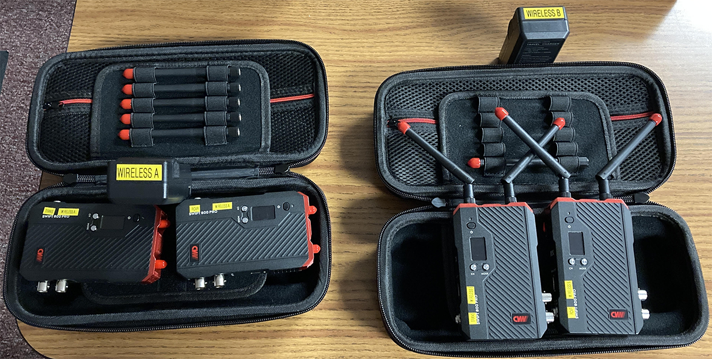

\-\-

The PLV Media Manual

Ethan Harvey, et. al.

* * *

Quick Links
===========

*   [MOAC Setup](#h.f2yn2rzgnbzh)
*   [BOAC Setup](#h.x8s3v51tqysz)

* * *

TABLE OF CONTENTS

[Quick Links](#h.unlme81q7eh1)        [1](#h.unlme81q7eh1)

[About This Manual](#h.sfpaor8716uz)        [10](#h.sfpaor8716uz)

[Contributors](#h.yf0sxsyhttlw)        [10](#h.yf0sxsyhttlw)

[Viewing Recommendations](#h.9eoktt69c208)        [10](#h.9eoktt69c208)

[Brand Identity](#h.7bmai9pwkh9p)        [11](#h.7bmai9pwkh9p)

[Colors](#h.3qf6m9ijbbq2)        [11](#h.3qf6m9ijbbq2)

[PLV Media](#h.2zgdpbigo2xl)        [11](#h.2zgdpbigo2xl)

[PLCS](#h.h9zlpe9bur59)        [11](#h.h9zlpe9bur59)

[PLHS](#h.almwrdnawfi0)        [11](#h.almwrdnawfi0)

[PLSHS](#h.13he9g5h773m)        [11](#h.13he9g5h773m)

[Other Schools’ Colors and Mascots (Class A)](#h.o5bzd3jh1pti)        [11](#h.o5bzd3jh1pti)

[Fonts](#h.ekylocrk785)        [14](#h.ekylocrk785)

[Logos](#h.ekylocrk785)        [14](#h.ekylocrk785)

[End card](#h.nyhjhho3y2ye)        [14](#h.nyhjhho3y2ye)

[Cameras](#h.1tcdkup64r9g)        [15](#h.1tcdkup64r9g)

[Canon](#h.vjmjymlqoi8a)        [16](#h.vjmjymlqoi8a)

[Vixia](#h.l4twkzqckyzg)        [16](#h.l4twkzqckyzg)

[XA10](#h.keb2bdg7cyd7)        [16](#h.keb2bdg7cyd7)

[XA25](#h.3s0e3ixuiw1q)        [16](#h.3s0e3ixuiw1q)

[XF305](#h.eti9bipsu7g)        [16](#h.eti9bipsu7g)

[JVC](#h.m0rb57krck3q)        [16](#h.m0rb57krck3q)

[Setup](#h.vfz346onfnq5)        [16](#h.vfz346onfnq5)

[Common Issues](#h.vuitgqb6l51a)        [16](#h.vuitgqb6l51a)

[My SDI isn’t outputting! My Display won’t show anything!](#h.wjyapubeqmgb)        [16](#h.wjyapubeqmgb)

[Tripods](#h.yuhtzim30a4)        [16](#h.yuhtzim30a4)

[Magnus Tripods](#h.qgkluorcks84)        [17](#h.qgkluorcks84)

[Fixing Broken Parts](#h.n95ub7h06doz)        [17](#h.n95ub7h06doz)

[3-Arm Connector Fix](#h.i4y8m1mireej)        [17](#h.i4y8m1mireej)

[Tension Arm Fix](#h.mcusd1vjcl5z)        [17](#h.mcusd1vjcl5z)

[Manfrotto Live Stream Tripods](#h.mc2yos8qqf89)        [18](#h.mc2yos8qqf89)

[Audio](#h.brk2alorp35y)        [18](#h.brk2alorp35y)

[Formats](#h.ebuwadv0scld)        [19](#h.ebuwadv0scld)

[Audition](#h.whp3bbk19dv5)        [19](#h.whp3bbk19dv5)

[Background Noise](#h.tevqsn89lyl0)        [21](#h.tevqsn89lyl0)

[Audio Artifacts](#h.xs8cjkeh6tfm)        [22](#h.xs8cjkeh6tfm)

[Getting Rid of Echoes](#h.7wtj3anlt3h1)        [25](#h.7wtj3anlt3h1)

[Adding Effects](#h.4hytokkhprgk)        [26](#h.4hytokkhprgk)

[Premiere Pro (Audio Info Only)](#h.r3sxcmh9ppiy)        [26](#h.r3sxcmh9ppiy)

[Video](#h.kkjzqxsoomxx)        [26](#h.kkjzqxsoomxx)

[Formats](#h.ljb6yjrnmdr0)        [27](#h.ljb6yjrnmdr0)

[Ingesting Footage](#h.ca5jaql8c97d)        [27](#h.ca5jaql8c97d)

[GFX](#h.ndtjbu9g0o6e)        [27](#h.ndtjbu9g0o6e)

[Formats](#h.tsdf6jkzolwe)        [28](#h.tsdf6jkzolwe)

[Colors](#h.uhvd5ijl0o2r)        [28](#h.uhvd5ijl0o2r)

[Why HEX codes?](#h.xlk4q3ptya2)        [28](#h.xlk4q3ptya2)

[What if I need to use other colors?](#h.ohrika58gwnj)        [29](#h.ohrika58gwnj)

[Without](#h.zdjlh317nq4r)        [29](#h.zdjlh317nq4r)

[With](#h.xooef14rqkps)        [29](#h.xooef14rqkps)

[Conclusion](#h.hrldi86p9tbk)        [29](#h.hrldi86p9tbk)

[Illustrator](#h.o1qns76qteau)        [30](#h.o1qns76qteau)

[What do you use Illustrator for?](#h.jhddzxvkecut)        [30](#h.jhddzxvkecut)

[Pros of Illustrator](#h.o2yio8mc5zip)        [30](#h.o2yio8mc5zip)

[Cons of Illustrator](#h.fhm7n471yel0)        [30](#h.fhm7n471yel0)

[What do we use Illustrator for?](#h.y5lalju0gp1d)        [31](#h.y5lalju0gp1d)

[Starting a Graphic](#h.9wijqfk2n23m)        [31](#h.9wijqfk2n23m)

[Creating the Document](#h.kkxg5qotnrvh)        [31](#h.kkxg5qotnrvh)

[The Tool Bar](#h.wcxjzb1fnncy)        [31](#h.wcxjzb1fnncy)

[Conclusion](#h.73nnwlwcxqrl)        [33](#h.73nnwlwcxqrl)

[Photoshop](#h.6p4emykjuoqk)        [33](#h.6p4emykjuoqk)

[What do you use Photoshop for?](#h.6px5x2mew0sf)        [34](#h.6px5x2mew0sf)

[Pros of Photoshop](#h.tbpwpyo39v62)        [34](#h.tbpwpyo39v62)

[Cons of Photoshop](#h.gldd41fa689s)        [34](#h.gldd41fa689s)

[Blender](#h.ic7f6983sbyu)        [34](#h.ic7f6983sbyu)

[Premiere Pro](#h.1mhv4uau4noj)        [34](#h.1mhv4uau4noj)

[Common Setup](#h.55kg5oeizqg)        [35](#h.55kg5oeizqg)

[Basic Editing Techniques](#h.xbs766oo4t3d)        [35](#h.xbs766oo4t3d)

[What’s a keyframe?](#h.802rm3xw55b0)        [35](#h.802rm3xw55b0)

[Installing a Preset into Premiere](#h.ll7zdq28cmsz)        [35](#h.ll7zdq28cmsz)

[Multicam Setup](#h.446eppr05334)        [35](#h.446eppr05334)

[About](#h.w3rd0pkf9mez)        [35](#h.w3rd0pkf9mez)

[Creating the Multicam Sequence](#h.m9ed8z9vfol4)        [35](#h.m9ed8z9vfol4)

[Adding Music (Outside of Storyblocks)](#h.3kwbq2ls5h1x)        [38](#h.3kwbq2ls5h1x)

[After Effects](#h.deagn8ol99gl)        [39](#h.deagn8ol99gl)

[Rotoing a video (Glamour Shot 2021 cleanup)](#h.qdtuba3nw8a1)        [40](#h.qdtuba3nw8a1)

[Beginner](#h.gucxuikcryfq)        [41](#h.gucxuikcryfq)

[About](#h.4qn5xe8xbs6v)        [41](#h.4qn5xe8xbs6v)

[Keyframing](#h.j014ps68vuyo)        [41](#h.j014ps68vuyo)

[Rotation keyframing](#h.r4l9j788la0u)        [41](#h.r4l9j788la0u)

[Intermediate](#h.vspvnhryuau0)        [41](#h.vspvnhryuau0)

[About](#h.ja1k8joa07qm)        [41](#h.ja1k8joa07qm)

[Advanced](#h.s68e1iivm3y1)        [41](#h.s68e1iivm3y1)

[About](#h.3pqr3tivzbvf)        [41](#h.3pqr3tivzbvf)

[Templates](#h.o131gzcry46w)        [42](#h.o131gzcry46w)

[About](#h.u1vv6cc2lvwr)        [42](#h.u1vv6cc2lvwr)

[Resources](#h.tt14hpfdpfkb)        [42](#h.tt14hpfdpfkb)

[HUDL](#h.myt678gj8d8j)        [42](#h.myt678gj8d8j)

[The Server](#h.f4nxr635jhly)        [44](#h.f4nxr635jhly)

[Connecting to the Server](#h.e0ef3mbnxlxz)        [44](#h.e0ef3mbnxlxz)

[Mac](#h.2pvdanq8zs63)        [44](#h.2pvdanq8zs63)

[PC](#h.93id3vz9yj57)        [44](#h.93id3vz9yj57)

[Stadium](#h.rzowkisrrkyb)        [44](#h.rzowkisrrkyb)

[Etiquette & Rules](#h.p0p5okyuovc)        [44](#h.p0p5okyuovc)

[Staying Organized](#h.2cbwwj7y562p)        [45](#h.2cbwwj7y562p)

[Live Streaming](#h.k6vpdgk5q6kp)        [45](#h.k6vpdgk5q6kp)

[Crew Roles](#h.oe5xh65xnh87)        [46](#h.oe5xh65xnh87)

[Uniforms](#h.7iv8dy6ci56v)        [46](#h.7iv8dy6ci56v)

[Producer](#h.3dkrvesjzx9m)        [46](#h.3dkrvesjzx9m)

[Tech Director (TD)](#h.8wgnnwhw8j4)        [46](#h.8wgnnwhw8j4)

[Switcher](#h.3asfil3lhd0h)        [46](#h.3asfil3lhd0h)

[Replay](#h.3asfil3lhd0h)        [47](#h.3asfil3lhd0h)

[GFX/Wirecast](#h.8f6jnighke35)        [47](#h.8f6jnighke35)

[Starting Wirecast & Titler Live](#h.dh43jlvy9sh1)        [47](#h.dh43jlvy9sh1)

[Output Settings and Restream.io](#h.4uegpbwwal3a)        [55](#h.4uegpbwwal3a)

[Template Requirements](#h.lml9wiv7y1k4)        [55](#h.lml9wiv7y1k4)

[Camera Operator](#h.8yt82sgom263)        [55](#h.8yt82sgom263)

[Camera Spotter](#h.8f1cfjikrutx)        [55](#h.8f1cfjikrutx)

[Commentator(s)](#h.58olhlijbt79)        [55](#h.58olhlijbt79)

[Pre-Season](#h.ewvc0jospo81)        [55](#h.ewvc0jospo81)

[During Season](#h.l93c671h47vc)        [55](#h.l93c671h47vc)

[Post-Season](#h.e1x7ftszygcp)        [56](#h.e1x7ftszygcp)

[Pre-Stream](#h.j2bztukfqq0u)        [56](#h.j2bztukfqq0u)

[During Stream](#h.or1ltjf3k4ak)        [56](#h.or1ltjf3k4ak)

[Post-Stream](#h.6o6f3lm49ueu)        [56](#h.6o6f3lm49ueu)

[Producing](#h.pyglj5jqa01q)        [56](#h.pyglj5jqa01q)

[Creating Live Streams (on Youtube)](#h.28ysxkdyzh6q)        [57](#h.28ysxkdyzh6q)

[Football](#h.z25gt7yei93t)        [57](#h.z25gt7yei93t)

[Note: (& this goes for producing ANY stream)](#h.gqtherj4aqna)        [57](#h.gqtherj4aqna)

[Crew](#h.942v4eezlk5q)        [57](#h.942v4eezlk5q)

[Pre-Stream](#h.ux4rua483x6d)        [58](#h.ux4rua483x6d)

[Set Up](#h.cyacubq1neiq)        [59](#h.cyacubq1neiq)

[Starting the Stream](#h.wrqmjcwz04ox)        [60](#h.wrqmjcwz04ox)

[During Stream](#h.i4oeo32lp3sq)        [60](#h.i4oeo32lp3sq)

[Half Time](#h.wi8g4o1167pt)        [61](#h.wi8g4o1167pt)

[Post-Stream](#h.7qv4tx8fp06)        [61](#h.7qv4tx8fp06)

[Common Issues/Troubleshooting](#h.8hjfv1rvhe86)        [62](#h.8hjfv1rvhe86)

[Volleyball](#h.dn65jwo6z4zt)        [62](#h.dn65jwo6z4zt)

[PLHS](#h.1cy6ndfrpwfy)        [63](#h.1cy6ndfrpwfy)

[PLSHS](#h.hlmkiajse2ay)        [63](#h.hlmkiajse2ay)

[Crew](#h.qjzefv5bhqhx)        [64](#h.qjzefv5bhqhx)

[Pre-Stream](#h.oovug53es09o)        [64](#h.oovug53es09o)

[Softball/Baseball](#h.64312d1irasl)        [65](#h.64312d1irasl)

[Wrestling](#h.as4c16jb8sl0)        [65](#h.as4c16jb8sl0)

[Basketball](#h.eee4aovhks17)        [65](#h.eee4aovhks17)

[PLHS](#h.4a3zykwco3uc)        [65](#h.4a3zykwco3uc)

[PLSHS](#h.1bkluzbuwxpl)        [66](#h.1bkluzbuwxpl)

[Soccer](#h.tvv1l35yv14)        [66](#h.tvv1l35yv14)

[Track](#h.e74fto7zip0w)        [66](#h.e74fto7zip0w)

[BOAC (Baby of all Cases)](#h.kwhq4y8y0apo)        [67](#h.kwhq4y8y0apo)

[Setting up During a Stream](#h.x8s3v51tqysz)        [67](#h.x8s3v51tqysz)

[Tearing Down](#h.wnkac2e9umy0)        [67](#h.wnkac2e9umy0)

[General Layout and Case Setup](#h.x63nua6neidb)        [68](#h.x63nua6neidb)

[Connections](#h.cmf4ipk4m8bg)        [69](#h.cmf4ipk4m8bg)

[Switcher - ATEM TV Studio](#h.shs4rtw85qxg)        [70](#h.shs4rtw85qxg)

[MOAC (Mother of all Cases)](#h.saa8t5379qfj)        [71](#h.saa8t5379qfj)

[General Layout and Case Setup](#h.jua7cz39joe0)        [71](#h.jua7cz39joe0)

[Still-In-Room Testing - Checklist](#h.gf8cmrvyi588)        [73](#h.gf8cmrvyi588)

[Setting Up In Practice](#h.f2yn2rzgnbzh)        [73](#h.f2yn2rzgnbzh)

[Setting up monitors and stands](#h.sk4alud60su7)        [73](#h.sk4alud60su7)

[Cables and Connections](#h.3w8y6r8zqch2)        [73](#h.3w8y6r8zqch2)

[Getting the Computers Working](#h.rw79h8sq1bzj)        [75](#h.rw79h8sq1bzj)

[Patch Panels](#h.vsalxlvegdls)        [75](#h.vsalxlvegdls)

[Network Switch & Access Point](#h.abe6w33jta81)        [76](#h.abe6w33jta81)

[Stream Setup](#h.167o7dw57cz3)        [76](#h.167o7dw57cz3)

[Hyperdeck](#h.ykr8z6k1c2lx)        [76](#h.ykr8z6k1c2lx)

[Start a Recording](#h.ltn5gr4fhuiq)        [76](#h.ltn5gr4fhuiq)

[The Hub](#h.4lkofo2glp7a)        [76](#h.4lkofo2glp7a)

[Using the Software Interface](#h.rwzqu9of0e7e)        [77](#h.rwzqu9of0e7e)

[Using the Hardware Interface](#h.4qqzllcqy3zj)        [77](#h.4qqzllcqy3zj)

[X32 Audio Rack](#h.nljzdzixaid2)        [77](#h.nljzdzixaid2)

[Setup](#h.ivey1as9f8k0)        [77](#h.ivey1as9f8k0)

[Adjusting Audio Level](#h.8wy2r1i9ufqi)        [78](#h.8wy2r1i9ufqi)

[Wirecast](#h.cuvnzrlfv5n8)        [78](#h.cuvnzrlfv5n8)

[Restream.io](#h.j437p4c5qafw)        [78](#h.j437p4c5qafw)

[Scene Setup](#h.8ppk5evarrhu)        [78](#h.8ppk5evarrhu)

[Titler](#h.ov0048n65p0j)        [78](#h.ov0048n65p0j)

[Switcher (ATEM TV Studio Pro 4K)](#h.o4vwz0fr8yte)        [78](#h.o4vwz0fr8yte)

[Network setup and configuration](#h.5gur8847nmep)        [79](#h.5gur8847nmep)

[Loading and Saving Switcher Configuration](#h.3q602jvfu35)        [79](#h.3q602jvfu35)

[Configuring Switcher Multiview & Routing](#h.orx665k35z0s)        [79](#h.orx665k35z0s)

[Creating and Using Macros](#h.dnug90jijlq1)        [81](#h.dnug90jijlq1)

[Advanced - Editing Macros After Creation](#h.z87vt3bzaa6p)        [81](#h.z87vt3bzaa6p)

[Troubleshooting](#h.qx3e739l8q69)        [82](#h.qx3e739l8q69)

[Operation](#h.pdik7zklqvah)        [82](#h.pdik7zklqvah)

[Preview and Program keys (Choosing Camera)](#h.yehhhfrdmbla)        [82](#h.yehhhfrdmbla)

[Macros](#h.h3vxqyeglyzy)        [83](#h.h3vxqyeglyzy)

[Audio](#h.ulhkbm2a5xk5)        [83](#h.ulhkbm2a5xk5)

[Replay (3Play) Deck](#h.yd6xqnrnyxmd)        [84](#h.yd6xqnrnyxmd)

[Setup - Creating a Replay File](#h.zbgg8gpatkar)        [84](#h.zbgg8gpatkar)

[Operation](#h.869xoom5s2ug)        [85](#h.869xoom5s2ug)

[Uninterruptible Power Supply (UPS)](#h.ffw26c5wsu6u)        [86](#h.ffw26c5wsu6u)

[Turning On](#h.2mbwo6xyei1e)        [86](#h.2mbwo6xyei1e)

[Turning Off](#h.f3s8d29ffty8)        [86](#h.f3s8d29ffty8)

[Wireless Cameras](#h.cg683l3v5t2x)        [86](#h.cg683l3v5t2x)

[Operation](#h.36h0ln31lqpz)        [87](#h.36h0ln31lqpz)

[Football Setup](#h.do73lia9kpd2)        [87](#h.do73lia9kpd2)

[Basketball Setup](#h.xwidn3kkobof)        [88](#h.xwidn3kkobof)

[Volleyball/Wrestling Setup](#h.tavk02ldj1u3)        [88](#h.tavk02ldj1u3)

[Softball Setup](#h.p78im6nfwn9u)        [88](#h.p78im6nfwn9u)

[Equipment](#h.fglkqcvgontl)        [88](#h.fglkqcvgontl)

[Teleprompter](#h.mnlany4v28uj)        [89](#h.mnlany4v28uj)

[Setup](#h.inoocvzhrssl)        [89](#h.inoocvzhrssl)

[Connecting the Display](#h.tq13k56lnn2w)        [89](#h.tq13k56lnn2w)

[Website and Usage](#h.c9ke6daeiwy1)        [90](#h.c9ke6daeiwy1)

[The Toolbox](#h.5lge0f1v9h9d)        [91](#h.5lge0f1v9h9d)

[Cables](#h.b016uhh7d2sk)        [91](#h.b016uhh7d2sk)

[Video Cables](#h.4u8jiq9l61r1)        [91](#h.4u8jiq9l61r1)

[Audio Cables](#h.xtkr6szaggln)        [91](#h.xtkr6szaggln)

[Power Cables](#h.atxmw9nxlgcv)        [91](#h.atxmw9nxlgcv)

[Data Cables](#h.oyw6b0pv25ej)        [91](#h.oyw6b0pv25ej)

[USB Types](#h.9zerk3otrabg)        [92](#h.9zerk3otrabg)

[Network Cables](#h.le17ehhv4zm3)        [92](#h.le17ehhv4zm3)

[News Package Standards](#h.rt9rd1pho1ok)        [93](#h.rt9rd1pho1ok)

[Conventions for Lower Thirds](#h.ue9dt5hssmg7)        [93](#h.ue9dt5hssmg7)

[Interview Best Practices](#h.ifat7panxma0)        [93](#h.ifat7panxma0)

[Contacting your Interviewee](#h.c82eh4qxsr8r)        [93](#h.c82eh4qxsr8r)

[Conduct](#h.n4hr7n5ia85u)        [93](#h.n4hr7n5ia85u)

[Rule of Thirds](#h.i50v0gzd7dj9)        [93](#h.i50v0gzd7dj9)

[“Talking Space”](#h.axafe8y4npw8)        [93](#h.axafe8y4npw8)

[Glamor Shots](#h.ubf5pc7fsdw4)        [93](#h.ubf5pc7fsdw4)

[Planning](#h.yhlbe6l1utsk)        [94](#h.yhlbe6l1utsk)

[Studio Prep](#h.krfbad9zangc)        [94](#h.krfbad9zangc)

[Lights](#h.4dzlzopr7rus)        [94](#h.4dzlzopr7rus)

[Camera/Tripod](#h.muk4eai9tetm)        [94](#h.muk4eai9tetm)

[Contact](#h.pv62gjtiusu7)        [95](#h.pv62gjtiusu7)

[Crew](#h.113385vzcc8s)        [95](#h.113385vzcc8s)

[Operation](#h.lm6s1e3x3h92)        [95](#h.lm6s1e3x3h92)

[Photographer](#h.uiqyizaxasqu)        [95](#h.uiqyizaxasqu)

[Cameraman](#h.u1jx2yg1ocx8)        [96](#h.u1jx2yg1ocx8)

[Director/Producer](#h.ool5br6dp9i0)        [96](#h.ool5br6dp9i0)

[Wrangler/Pit Crew](#h.etpvspdhpdy7)        [96](#h.etpvspdhpdy7)

[Editing & Distribution](#h.9vvcwvmskuqs)        [97](#h.9vvcwvmskuqs)

[Editing Process](#h.mh1yk5ft7f65)        [97](#h.mh1yk5ft7f65)

[‘Roto’ing GIFS](#h.9bttufv9z505)        [101](#h.9bttufv9z505)

[Boxout](#h.hzhcsfd6pj7o)        [102](#h.hzhcsfd6pj7o)

[Video Board](#h.nb3tcfvto63g)        [103](#h.nb3tcfvto63g)

[Daktronics Video Board (Stadium)](#h.mp2wk13ytfu)        [104](#h.mp2wk13ytfu)

[Folder Maintenance](#h.jn56rv3ics60)        [104](#h.jn56rv3ics60)

[Content Requirements](#h.1olx72n7qklj)        [107](#h.1olx72n7qklj)

[Sound System](#h.ylavr7vl2llp)        [108](#h.ylavr7vl2llp)

[Event Prep](#h.phqqi3wldshi)        [108](#h.phqqi3wldshi)

[Football](#h.gktmpujxp8ys)        [108](#h.gktmpujxp8ys)

[Communications](#h.regce4dhjgdq)        [108](#h.regce4dhjgdq)

[Videos](#h.to91djqrqshk)        [110](#h.to91djqrqshk)

[Sponsors](#h.ty20wxhz7sav)        [111](#h.ty20wxhz7sav)

[Scripts](#h.vyviavm7km9h)        [112](#h.vyviavm7km9h)

[Graphics](#h.hiyqpq1tlhql)        [112](#h.hiyqpq1tlhql)

[TMI](#h.kmoy2b4ieav7)        [113](#h.kmoy2b4ieav7)

[Tater Trot](#h.p26swzo2ejbw)        [113](#h.p26swzo2ejbw)

[Soccer](#h.p26swzo2ejbw)        [114](#h.p26swzo2ejbw)

[Track](#h.p26swzo2ejbw)        [114](#h.p26swzo2ejbw)

[Unified Sports](#h.p26swzo2ejbw)        [114](#h.p26swzo2ejbw)

[6th Grade Field Days](#h.p26swzo2ejbw)        [114](#h.p26swzo2ejbw)

[Special Events](#h.p26swzo2ejbw)        [114](#h.p26swzo2ejbw)

[Operation](#h.q7hhdn902h7u)        [114](#h.q7hhdn902h7u)

[Football](#h.lsrwsm8nkwya)        [114](#h.lsrwsm8nkwya)

[TMI](#h.lsrwsm8nkwya)        [115](#h.lsrwsm8nkwya)

[Tater Trot](#h.lsrwsm8nkwya)        [115](#h.lsrwsm8nkwya)

[Soccer](#h.lsrwsm8nkwya)        [116](#h.lsrwsm8nkwya)

[Track](#h.lsrwsm8nkwya)        [116](#h.lsrwsm8nkwya)

[Unified Sports](#h.lsrwsm8nkwya)        [116](#h.lsrwsm8nkwya)

[6th Grade Field Days](#h.lsrwsm8nkwya)        [116](#h.lsrwsm8nkwya)

[Special Events](#h.lsrwsm8nkwya)        [116](#h.lsrwsm8nkwya)

[Scorevision Video Boards (Gymnasiums)](#h.8gojh3spy7id)        [117](#h.8gojh3spy7id)

[Web Interface](#h.ds3xx4yoj276)        [117](#h.ds3xx4yoj276)

[Changing/Adding New Seasons](#h.fjej5pw3bwn8)        [117](#h.fjej5pw3bwn8)

[Adding Teams](#h.n1x6n3ue1rls)        [117](#h.n1x6n3ue1rls)

[Adding Rosters](#h.bg5w1lyctnox)        [119](#h.bg5w1lyctnox)

[Adding and Configuring Media (Video)](#h.byy30sqaeeg1)        [120](#h.byy30sqaeeg1)

[Adding games](#h.k3msxg6ldh3y)        [122](#h.k3msxg6ldh3y)

[Operation (ScoreVision Producer App)](#h.292abzx45sz1)        [122](#h.292abzx45sz1)

[The Room (401)](#h.x7cwwn36er8m)        [122](#h.x7cwwn36er8m)

[Organizational Layout](#h.xv1q56bh8msy)        [123](#h.xv1q56bh8msy)

[Where is everything‽](#h.77axbr6kt264)        [123](#h.77axbr6kt264)

[Cables](#h.51mgxt56st0v)        [123](#h.51mgxt56st0v)

[Video](#h.pvzrvvq1vp9q)        [123](#h.pvzrvvq1vp9q)

[Troubleshooting](#h.g2ud8d4rvknq)        [124](#h.g2ud8d4rvknq)

[Connections and Cables - Physical](#h.qlqadw87rwh1)        [124](#h.qlqadw87rwh1)

[“Nothing is showing up!”](#h.ycnu1wneh58j)        [124](#h.ycnu1wneh58j)

[Website](#h.2d4hxuidis1p)        [125](#h.2d4hxuidis1p)

[Social Media](#h.hhog2pau3l76)        [126](#h.hhog2pau3l76)

[Youtube](#h.7wmrx0npljrh)        [127](#h.7wmrx0npljrh)

[Facebook](#h.vlc5w4iq41u6)        [127](#h.vlc5w4iq41u6)

[Twitter](#h.e94cs9ubypym)        [127](#h.e94cs9ubypym)

[Instagram](#h.55pkc7iq6777)        [127](#h.55pkc7iq6777)

[Ads](#h.obmntodpl9hy)        [127](#h.obmntodpl9hy)

[In-Stream Ads](#h.8h0ei1wtldtl)        [128](#h.8h0ei1wtldtl)

[Video Board Ads](#h.wg11isc5u06j)        [128](#h.wg11isc5u06j)

[Animated](#h.680vjoa85h2a)        [128](#h.680vjoa85h2a)

[Still](#h.915io6ntcfh7)        [128](#h.915io6ntcfh7)

[Video](#h.ntfmh1kc1qnl)        [128](#h.ntfmh1kc1qnl)

About This Manual
=================

Contributors
------------

*   Ethan Harvey

*   Concept, Manager, Writing (MOAC, Videoboards, other misc.), Editing
*   Future Contact, if needed: (402) 591-1808 or [ethan@ethanharv.com](mailto:ethan@ethanharv.com)

*   Hoch

*   Direction, Ideas, Clarification, Editing

*   Abigail Jensen

*   GFX

*   Krystin Collins

*   ScoreVision
*   Producing a Stream

*   Austin Tejral

*   Daktronics Video Board
*   Glamor Shots

*   Peyton Hylok

*   Commentating

*   Nick Olson

*   Website
*   Replay

*   Logan Servant

*   Producing a Stream
*   Crew Roles
*   Social Media

*   Leah Hunter

*   Premiere Pro Multicam
*   Roto’ing in After Effects
*   Editing Glamor Shots
*   Adding Outside Music

*   Charlie Breinholt

*   Daktronics Video Board
*   Adobe Audition

Viewing Recommendations
-----------------------

*   View -> Print Layout (off)

*   With Print Layout on, some images act wonky.

On Mobile, download the Google Docs app to view it in, as it's a MUCH nicer experience than browser view.

* * *

Brand Identity
==============

Colors
------

### PLV Media

*   PLV Media Grey/Black HEX: #282828

### PLCS

*   PLCS Gold HEX: #fecb38
*   PLCS Grey HEX: #8e8e8e

### PLHS

*   Monarch Maroon HEX: #660600
*   Monarch Gold HEX: #f5c518
*   Monarch Grey HEX: #b2b2b2

### PLSHS

*   Titan Blue HEX: #003466
*   Titan Grey HEX: #c9c9c9

### [Other Schools’ Colors and Mascots (Class A)](https://www.google.com/url?q=https://docs.google.com/spreadsheets/d/10EkGKsYjn8sd8cH6IUJoo6p3pQC3YNo1/edit?usp%3Dsharing%26ouid%3D101779960471521061809%26rtpof%3Dtrue%26sd%3Dtrue&sa=D&source=editors&ust=1646435714208112&usg=AOvVaw2ECTSg4Smwpb3Nk0F0jvsf)

Unless specified otherwise, these are pulled from the team’s maxpreps page, and beyond that do not represent “official” colors/style guides. Still should be more than good enough for 90% of projects.

If a color is labeled with “(TFL)” it indicates that the color was taken from the logo and manually found that way, and should not be taken as an exact brand-recognized color (as things like image noise, etc. can interfere). However, it should be more than close enough for most things.

Colors all in HEX format.

*   Bellevue East Chieftains

*   Purple: #4E1F91
*   White: #FFFFFF

*   Bellevue West Thunderbirds

*   Purple: #4B0082
*   Gold: #FFD700
*   White: #FFFFFF

*   Bennington Badgers

*   Blue: #000080
*   White: #FFFFFF

*   Boys Town Cowboys

*   Blue: #0000FF
*   Darker Blue (TFL): #0D37A6
*   White: #FFFFFF

*   Creighton Prep Junior Jays

*   Blue: #0000FF
*   Darker Blue (TFL): #0039d0
*   White: #FFFFFF

*   Elkhorn Antlers

*   Red: #FF0000
*   Gray (TFL): #919594
*   White: #FFFFFF

*   Elkhorn South Storm

*   Gray: #919594
*   Blue: #003A63
*   Gold/Yellow: #8F7700
*   White: #FFFFFF
*   Tan (TFL): #A48E5C

*   Fort Calhoun Pioneers

*   Orange: #FF7F00
*   Black: #000000

*   Fremont Tigers:

*   Yellow: #FFD700
*   Black: #000000
*   Brown/Orange (TFL): #B07328

*   Grand Island Islanders

*   Purple: #4B0082
*   Yellow: #FFD700

*   Gretna Dragons

*   Green: #008000
*   Yellow: #FFD700
*   White: #FFFFFF

*   Hasting Tigers

*   Orange: #FF7F00
*   Black: #000000

*   Kearney Bearcats:

*   Blue: #0000FF
*   Yellow: #FFD700
*   Dark Blue (TFL): #010254

*   Lincoln East Spartans

*   Blue: #0000FF
*   White: #FFFFFF
*   Lighter Blue (TFL): #365AAC

*   Lincoln High

*   Red: #DA001E
*   Black: #00000

*   Lincoln North Star Navigators

*   Blue: #000070
*   Maroon: #880030

*   Lincoln Northeast Rockets

*   Gray: #0C1E0D

*   Lincoln Pius X Thunderbolts

*   Green: #046A38
*   Gold: #FFD100

*   Lincoln Southeast Knights

*   Gold: #A8996E
*   Black: #000000

*   Lincoln Southwest Silver Hawks

*   Green: #00713D
*   Silver: #D8D9D8

*   Millard North Mustangs

*   Green: #00817
*   Blue: #003899

*   Millard South Patriots

*   Red: #FB0009
*   Red: #E20101
*   Blue: 0101AE

*   Millard West Wildcats

*   Green: #277000
*   Norfolk Panthers
*   Maroon: #52131E
*   Grey: #A1A2A4
*   Maroon: #4D151F

*   North Platte Bulldogs

*   Blue: #0234D5
*   Gold: #FBCA0D

*   Omaha Benson Bunnies

*   Green: #6DB33F

*   Omaha Bryan

*   Green: #C4AE00
*   Green: #004601
*   Gold: #C4AE00
*   Green: #004705

*   \[TODO: This Down\]
*   Omaha Burke
*   Omaha Central Eagles
*   Omaha Marian Crusaders
*   Omaha North Vikings
*   Omaha Northwest Huskies
*   Omaha Skutt Skyhawks
*   Omaha South Packers
*   Omaha Westside Warriors
*   Ralston Rams
*   Scottsbluff Bearcats Red Paw
*   South Sioux City Cardinals

Fonts
-----

*   Our Standard Fonts:

*   \[TODO\]

*   PLV Media Logo Fonts

*   The main “PLV” is in “Webnar” - You can find the .otf in Fonts -> Webnar-Bold
*   The “MEDIA” is in RBNo2Light - You can find the .otf in Fonts -> RBNo2Light

Logos
-----

All logos can be found on the server, under the Logos folder

End card
--------

To add an end card

        -Open the server

        -Go to logos

        -Go to PLV Media Logo

        -Go to EndCard

To use the premade PLV Media outro (which I would strongly suggest) use endcardvideo7.mp4.  Use ENDCARD\_7.png for just the image.

If you used the image feel free to just put that into your project and then join back at the next step.

If you used the video, put that into your project with the video layer one above our layer you want it to fade from and it will do it automatically.

Important is that you do not adjust the length of the end still frame (or if you do adjust it in youtube as well)  

REJOIN

Upload it to YouTube. Then, in video elements click add under add an endscreen. Then in the upper right click import from video.  Search USETHIS (endcard).  Click it.  Double check that all three elements are set to be 10 seconds.  Take the lower right dot of the blue box and drag it as far as it will go.  Then hit save.  Then continue and publish your video and you are done.

Cameras
=======

\[TODO:\]

*   Photos and descriptors of each camera and battery and charger—call out how that camera is visually different (XA25 record button is red, body is wider; batteries are clearly marked)

Canon
-----

### Vixia

\[TODO:\]

*   Note that these need a 3.5mm to XLR cable for external mic

### XA10

\[TODO:\]

### XA25

\[TODO:\]

### XF305

\[TODO:\]

*   Note that this camera needs a different memory card available for checkout from Hoch

JVC
---

We use JVC cameras primarily for streams.

### Setup

[JVC Camera and Manfroto Streaming Tripod instructions](https://www.google.com/url?q=https://docs.google.com/document/d/1tEeGrExoEoM0UwCHkSWTLOjBPLeZc--sqhEDyHGrvYc/edit?usp%3Dsharing&sa=D&source=editors&ust=1646435714221442&usg=AOvVaw0TrNQpdjtz7XV766iAwoA3)

### Common Issues

#### My SDI isn’t outputting! My Display won’t show anything!

This is almost always a problem with the output settings. You can change them by doing:

*   Main Menu -> A/V Set \-> Video Set \-> HDMI/SDI Out \-> HDMI+SDI

All menu buttons are on the left side of the screen.

* * *

Tripods
=======

Magnus Tripods
--------------

We use these for the XA10 and XA25 cameras.

### Fixing Broken Parts

A few of the parts have a tendency to break. A few 3d-printable replacements have been made by Harv.

#### 3-Arm Connector Fix

In the toolbox, there should be a kit with a bunch of these.

If you lost that, or you’re out, the STL is in the server under “3D\_Printer\_Files -> Magnus\_Tripod\_3\_Arm\_Connector -> NEW\_Magnus\_Tripod\_Arm\_Connector\_Good\_Topo.stl”

There is a README in the same directory as the stl file, I would recommend reading that.

It can take awhile to get the old rivets off, just be patient.

#### Tension Arm Fix

In the toolbox, there should be a kit with a few of these.

If you lost that, or you’re out, the STL is in the server under “3D\_Printer\_Files -> Magnus\_Tripod\_Tension\_Arm\_Fix -> TripodHandleFix-MainBody.stl”

Unscrew it using a hex key. The back should fall out, make sure not to lose the locknut. 

You can pop the screw out by just pushing on the end, and then the metal pin should be able to come out too.

Reassembly is the same, just make sure to put the screw head in the side of the pin with the flat cutout.

It is recommended to use the heat gun to help push the pin in, it can be stubborn. You may also want to make a chamfer on the edge you’re pushing it in on to help guide it, just use a pair of pliers and spin it around in the opening.

Manfrotto Live Stream Tripods
-----------------------------

\[TODO:\]

* * *

Audio
=====

Formats
-------

.wav

.mp3

.ogg

.aac

AIF, AIFF, AIFC

.sesx

Audition
--------

Audition is our main audio editing software. You can fix basic things like audio levels and crossfade in Premiere Pro, but for more complex things such as removing background noise or audio artifacts, you’ll need Audition.

Basics

Like most Adobe programs, you can open a video or audio file by dragging it into the Audition interface or right clicking the file and hit Open with > Adobe Audition.

Audition will open like this first screenshot. This black window with the green lines is the waveform window. You really don’t need the waveform window, it just shows you how loud the audio is by how tall the waves are. (You can zoom in to see the individual waves better if you’re curious)

The spectral display window- which is the purple, orange, and yellow colored one- can too, based on color (black is silent, yellow is loudest), but it also shows other things such as audio artifacts and where certain sounds are coming from pitch-wise.

Again, you don't need the waveform, so drag up these three dots at the bottom of the window to see the spectral display. Zoom in/out by squishing/expanding this gray box on top. You can move it to the specific selection of audio you want to edit.

\[TODO\]\*add tutorial on basic tools\*

Getting Rid of Unwanted Audio

The red and orange bubbles are bits of audio you don’t want. Unwanted sounds (circled in orange), such as a school bell ringing, are called audio artifacts. Background noises (circled in red), such as a fan in the background, are also called artifacts, but for the sake of understanding, I’ll just call these general sounds background noises. Getting rid of them is pretty easy, it might just take a while.

-----------------------

### Background Noise

First, let’s get rid of the air conditioning sounds in the background. Select a rectangle of just background audio. It’ll just look like grainy purple. Make sure your selection includes ALL pitches (from the bottom to the top of color) otherwise it’ll just get rid of all high- or low-pitched background noise. I recommend recording “nothing” in the space you’re filming to ensure that you have enough background noise to capture a noise print. Just a few seconds should be enough.

Then go to Effects > Noise Reduction/Restoration > Capture Noise Print. This makes a blueprint of what background noise looks like so Audition can get rid of it in other places. In order to get rid of all background noise in a selection, click two times in the colored box. In order to get rid of all the background noise in the whole audio clip, click three times.

After you’ve selected the clip you’d like to fix, go to Effects > Noise Reduction/Restoration > Noise Reduction (process).

A window will pop up where you can edit how much unwanted audio you reduce. Honestly, I don’t really know what the difference is between the “noise reduction” and the “reduce by” sliders is, but I know that it’s better to mess with the “reduce by” slider first, then the “noise reduction” slider. Just mess with the sliders until it sounds the best. There’s also this blue line that you can adjust. In this clip, Mikee and Meredith are talking. Meredith has a higher pitched voice and is talking quieter. Mikee has a lower pitched voice and is talking louder. To equalize them, I’m going to move the right side of the blue line up to make higher pitches (Meredith’s voice) louder.

### Audio Artifacts

Now that you’ve got background noise taken care of, we can get rid of audio artifacts. In this screenshot, there’s a keyboard clicking in the background (circled in red). We’re going to get rid of it using the marker up top circled in green.

First, you want to make sure that you know you’re erasing what you want to erase. Select where the audio artifact is, then listen to that selection. Keep listening and moving the borders of that selection in until you’ve selected nothing but the artifact. This is how you know where to erase.

Drag in the sides of the gray box to zoom into your artifact so you can more accurately erase what you need to. Select the paintbrush tool. ONLY use the paintbrush tool for erasing artifacts, the spot healing tool isn’t as precise. Make sure to adjust the size and opacity of your brush. Note that the brush opacity on Audition maxes out at 50. This doesn’t mean that 50 is 50% opacity, but rather 100%, So, for example, 25 = 50% for some reason. Now you can erase the artifacts. I like to reduce the brush opacity to ~30 since there are different levels of “opacity” in the spectral display. That “opacity”- I’m not sure how else to describe it- is the same thing as loudness and again, is visualized by a spectrum of black (silent) -> yellow (loudest).

### Getting Rid of Echoes

Select all of your clip by clicking three times. Go to Effects > Noise Reduction/Restoration > DeReverb. If you go into Effects > Delay and Echo that will just add more echo! Unless you’re working on a personal project that requires this effect, you always want to get rid of any echo that’s present. There will be a window that pops up, similar to when you’re getting rid of background noise.

First, you want to select which frequencies that have the most echo. You only really need the first two buttons. The first focuses on all frequencies, and the second focuses on lower frequencies. It depends on your audio clip which button you need. Then, go to the reduction amount slider. Mess around with it until it sounds the best it can. Also, to the right of this window is an optional gain adjuster. I’ve never come across a situation in which

### Adding Effects

\[TODO:\]

Premiere Pro (Audio Info Only)
------------------------------

\[TODO:\]

Video
=====

Links:

*   [Premiere Pro Section](#h.vdhdrgfuovqo)
*   [After Effects Section](#h.deagn8ol99gl)

Formats
-------

For our use, we always recommend ingesting mp4 files, also known as H.264. We import with this, we use this, we export to this—almost everything you do should be in mp4. If you keep it all the same, it makes life easier.

Ingesting Footage
-----------------

\[TODO:\]

GFX
===

The majority of this was written by me, Abigail Jensen. If you have any questions or whatever, whoever you are, even if I don’t know you, you can contact me. My phone number is 402-740-2089 and my Snapchat is graphixareece. All I ask is that you state you’re in the Media Academy and I will be free to answer any question that you have.

Want the best tip I can give you? If nothing is in here, GO TO YOUTUBE. It has helped me so much. There are so many little things that I wanted to do that I just looked up and now I use them so much. This goes for everything, not just graphics. Also, use Pinterest, Instagram, Twitter, and any social media you want for inspiration or to learn cool things. Pinterest gives you so many ideas, and I have learned so much from Instagram and Twitter. Use them to your advantage. Just follow a few accounts so you can see stuff when you scroll through your feed. Trust me, it helps so much.

Formats
-------

[See Also: Video Formats](#h.ljb6yjrnmdr0)

JPEG/.JPG - Compressed image, not recommended for use unless you have a specific workflow reason. Used for things that are printed off; also used for YouTube thumbnails (must be 200mb or smaller).

PNG - Supports color data, is generally the standard for a high-quality export.

SVG - Vector format, meaning that the image data is stored as lines and points instead of colors, has theoretically infinite resolution.

EXR - Likely only used for blender, stores much more data about the image, with the downside of huge file sizes.

Colors
------

(Also see: [Brand Identity -> Colors](#h.3qf6m9ijbbq2))

Monarchs HEX codes

*   Maroon: 660600
*   Gold: f5c518

Titan HEX codes

*   Blue: 003466
*   Silver: c9c9c9

PLV Media HEX codes

*   Grey: 282828
*   White: ffffff

PLCS HEX codes

*   Gold: fecb38
*   Grey: 8e8e8e

Why HEX codes? 
---------------

HEX codes use RGB (Red, Green, and Blue) to color objects. RGB uses the primary colors of light rather than pigment (that’s CMYK: cyan, magenta, yellow, and black), which is what computers and other screens use to project an image. RGB is what will be most compatible for digital graphics. Anything not printed out should use RGB/HEX color codes. In the RARE chance that you need something printed out, convert the color to CMYK. There are often issues when it comes to using CMYK online and RGB for print. Colors won’t print correctly with RGB, and colors often seem dull digitally when using CMYK. Using the proper type of color will make your job much easier.

What if I need to use other colors?
-----------------------------------

I’m not going into color theory right now you can Google that yourself. However, I will recommend you use this—[coolors.co](https://www.google.com/url?q=https://coolors.co/&sa=D&source=editors&ust=1646435714231744&usg=AOvVaw16iSp-9aGboNueFMgUpcj7). It is something you can use to create color palettes, which will in turn help your design look better. Here are two examples, with and without using a color palette.

### Without

This is okay. It’s legible, and that’s essentially what matters. However, there are ways to make it look better that don’t take much time.

### With

This is better. It was made using a color palette, so the stress of having to find a color was taken away, and it looks more appealing to the eyes. If you have trouble using color, use this. If you don’t have trouble using color, use this. It will make your stuff look so much better. Trust me. (Also don’t ask why it’s blurry. I don't know what happened and it’s really not making me look good.)

### Conclusion

I can talk about color forever, but this is essentially all you need to know to get started and make good graphics. Like I said, if you want to learn more, Google is free, and I am always open for questions.

If you want to learn more, start here:

*   [99design](https://www.google.com/url?q=https://99designs.com/blog/tips/the-7-step-guide-to-understanding-color-theory/&sa=D&source=editors&ust=1646435714232956&usg=AOvVaw0EsOxheR1YKLOzpQGKr0qQ)
*   [BlackBearDesign](https://www.google.com/url?q=https://www.blackbeardesign.com/blog/graphic-designers/understanding-color-the-meaning-of-color/&sa=D&source=editors&ust=1646435714233196&usg=AOvVaw3OFBXlWJsY0Ib_ClDeAd3k)
*   [Beginning Graphic Design](https://www.google.com/url?q=https://edu.gcfglobal.org/en/beginning-graphic-design/color/1/&sa=D&source=editors&ust=1646435714233403&usg=AOvVaw0E50JAgJzYXjZe7gOEtV42)

Illustrator 
------------

### What do you use Illustrator for?

Illustrator is software, part of the Adobe Suite, that is based on using vector graphics. In layman's terms, a vector is a graphic that you can zoom in on infinitely and it’ll never show pixels.

This is the best example of the difference between vectors and rasters that I could find:

If this manual were an Illustrator file, you could infinitely zoom in on the vector bunny and it’d never show it’s pixels (don’t try it on here, it was converted to a raster to be included here).

#### Pros of Illustrator

A great time to use Illustrator is when making a logo. You can make it as small or as big as you want, and it’ll pretty much always look good. Blowing up vectors rarely causes issues. You can also use Illustrator for layout graphics (like thumbnails, video board graphics, and anything you want in a video). You can also be as precise as you need to be with Illustrator. For anything dealing with logos, posters, any type of digital or print sign, Illustrator is where to go.

#### Cons of Illustrator

Illustrator has minimal image editing features. If you’re using an image, it’ll be hard to solely use illustrator to make your graphics. Good news is, Illustrator is very compatible with Photoshop.

In addition, unfortunately, vectors won't necessarily work with programs like Word (that’s why I had to turn that photo into a raster). According to other people, Illustrator is hard to learn and I understand completely. Don’t let that discourage you though. I personally found Illustrator to be very easy for me to use, but I struggled with Premiere. It really just depends on the person. I’m only stating this so you are aware that it may be confusing.

### What do we use Illustrator for?

We, as PLV Media, generally use Illustrator for most still graphics that we need. This includes Thumbnails, Lower Thirds, and anything for the video boards.

### Starting a Graphic

I am writing this assuming you have basic knowledge of Illustrator.

#### Creating the Document

Once you’ve opened Illustrator, you’ll be asked to create the document. From here, you can choose the number of artboards and the size of the document (plus more that shouldn’t be useful to you for most graphics you will make). Most graphics you create will probably only need one artboard, but the size varies. You can choose your own specific size, or select the preset sizes that Illustrator has. However, unless stated otherwise, you will be using 1920 x 1080 pixels, or the Web Large or HDV/HDTV 1080 preset. The preset you choose depends on how you like to use Illustrator. I prefer to use Web Large.

#### The Tool Bar

Here is what the toolbar looks like.

You can identify it on the left side of your artboard. It includes every tool that Illustrator has to offer. More tools are located under the objects with little triangles in the bottom right of the box. You can access these by holding down on the block and clicking on whatever tool you want to use. A lot of these are very similar and can be used in different scenarios or based on user preference. Use what makes you feel comfortable. I’ll give you a quick rundown of the tools that you will use the most in the academy. Once again, if you want to know how to use something that I don’t tell you, use Google or just ask me.

Here are the tools that we use the most:

The selection tool (V): Used to select objects or groups (duh), move them, size them, rotate them, the tool that you’ll use the most.

The direct selection tool (A): Essentially the selection tool, but it can be used to isolate certain paths objects even if they're within a group.

The pen tool (P): Used to make lines and create and edit anchor paths and objects. I found this confusing to learn so I would suggest playing the [Bezier Game](https://www.google.com/url?q=https://bezier.method.ac/&sa=D&source=editors&ust=1646435714236277&usg=AOvVaw2tHW7zapBtAMW0alWMIDTT) to learn how to use the pen tool. It’s easier with the pen tool to make technical and precise drawings once you really get it down. You can adjust the fill and stroke if necessary. Much better for what we do.

The curvature tool (Shift + \`  ): Much like the pen tool, the curvature tool is used to make and edit anchor paths and objects. The difference between the tool is this lacks the ability to be as precise as the pen tool. However, it is much easier to use, and much better for creative work. With the curvature tool, you click the tool once for a curve and once for a point. You can also tell what each point is by checking to see if there’s a dot in the middle of the point. If there is, it’s a pointed edge. Like the pen tool, you can adjust the fill and stroke if necessary. Not necessarily the best for what we’ll do unless you need to get creative.

The rectangle tool (M): Used to create rectangles of any size and variation. If you hold down on the rectangle tool in the toolbar you have access to the ellipse tool (L), the polygon tool, the star tool, and the line segment tool (\\). All of these are used to create their respective shapes. We often use this to create backgrounds, lower thirds, and anything that needs to have an exact shape. For all of these you can adjust the fill and stroke to what you want. Instead of using the pen tool for rectangles and circles, this is what you should use.

The paintbrush tool (B): Not something we use a lot. The tool is very simple to use and a lot like other paintbrush tools in other programs. The only time we would use this is for texture on an object. I only included it because it could be interesting to use. You can adjust the size, fill, and stroke if needed.

The text tool (T): Used to create text boxes and type in them. This is probably what we use the most out of any tool. You can change the font size, the font selection, font color, the stroke, and you can edit the text in essentially any way you can imagine.

The eraser tool (Shift + E): Used to erase points and parts of objects. Once again, I don’t think we use this much but just in case you do need to use it here you go. You can adjust the size if needed.

The eyedropper tool (I): Used to select a color from a certain object and apply it to another. You select the object you want to recolor, then use the tool to click on the object with the color desired and apply it to the other object. Pretty useful if you want to get the exact color used in a logo.

The gradient tool (G): PLEASE DO NOT OVERUSE. I use that preface because I have not only seen but made graphics with a horrendous use of gradient. That being said, it’s a pretty useful tool. It adds a little bit of dimension and makes your graphic a little more dynamic. You can select linear, radial, or freeform gradients to use. If you’re going to use it, I would suggest using subtle gradients instead of something drastic. Very useful, but could also look terrible.

The zoom tool (Z): Used to zoom in and out. You click normally to zoom in, and you opt+click to zoom out. You can also use ⌘ + to zoom in and ⌘ - to zoom out, and ⌘ 0 to go back to normal view.

### Conclusion

This has been your general overview over Adobe Illustrator. If you are wondering how to make a specific thing in Illustrator, you can check out the specific section of the manual dedicated to tutorials on how to make graphics.

Photoshop
---------

### What do you use Photoshop for?

It’s kinda in the name. Photoshop is used to adjust an image, whether it would be a photo or another graphic. Need to adjust a photo’s color? Take it to Photoshop. Need to cut out a picture of someone for a graphic? Take it to Photoshop. Need to clean up a logo that someone sent you without a single drop of empathy for how we would feel having to clean it up. You guessed it, take it to Photoshop. It’s like Illustrator, but for left-brained, analytical, methodical people. It’s more organized, but it limits creativity when it comes to creating certain graphics. The creativity with Photoshop comes when you start editing a photo.

Photoshop works in rasters ([see bunny example above](#h.o1qns76qteau)). This means that if you zoom in on the raster bunny you will eventually see pixels of different colors that make up the image. These are essentially universal to use. You can put these in word documents, in videos in Premiere, and anywhere you may need them to be.

#### Pros of Photoshop

People generally say that it’s easier to use than Illustrator, which could be true for you, or not. There’s a wide variety of things you can do when it comes to photos. There are countless photo editing tools that are extremely useful. Most of the useful tools in Photoshop are photo editing based, rather than being centered on creating graphics

. You can also use it to create graphics if you’re in a pinch and need something simple and easy to make.

#### Cons of Photoshop

There isn’t as wide of a variety when it comes to what you can do when making graphics. Graphics made in Photoshop can often look simpler than graphics made in Illustrator, which isn’t necessarily bad - it depends on what you like. I don’t know if this will make sense, but Photoshop is kinda chunkier. It’s chunky. The way that things are set up isn’t very smooth. This could help someone who needs help with symmetry and centering things, but ultimately annoys me.

Blender
-------

Want to really learn blender? Take a weekend and do the [donut tutorial](https://www.google.com/url?q=https://www.youtube.com/watch?v%3DnIoXOplUvAw%26list%3DPLjEaoINr3zgFX8ZsChQVQsuDSjEqdWMAD&sa=D&source=editors&ust=1646435714238718&usg=AOvVaw3QboQxkiqveDqwxfAHlLm5).

* * *

Premiere Pro
============

Common Setup
------------

\[TODO\]:

Basic Editing Techniques
------------------------

\[TODO\]:

What’s a keyframe?
------------------

\[TODO\]:

Installing a Preset into Premiere
---------------------------------

*   Install desired preset off of Google
*   Move download into PLV Media>Video Copilot Downloads>Premiere Presets
*   Unzip the file and create a new folder with all of its contents
*   Open Premiere
*   Go the the Effects tab
*   Right-click on the folder with a star named “Presets” and select ‘Import Presets’
*   Go to PLV Media>Video Copilot Downloads>Premiere Presets>\[Preset Folder\]
*   Select the PRFPSET File and click Open

Multicam Setup
--------------

### About

In this section of Premiere Pro, you will explore how to effortlessly sync together multiple camera angles of one take. Instead of trying to sync audio tracks to one another by hand, multicam does it for you. Multicam Source Sequencing is the best way to create diversity in your project with different camera angles. In the server under PLV Media>PLVMediaGuide>Premiere Pro>Multicam Setup you can practice and follow along within the premiere project.

### Creating the Multicam Sequence

Before you even begin editing, remember to set up a clap, or a sync, when filming to make life much easier. This would be something along the lines of “Song 1 Take 1.” Now, you can begin editing. First, you have to open up your premiere project and place your clips into the bottom left box. It is suggested that you utilize bins to keep track of the clips that go together to avoid any confusion. Next, go through your clips to find your desired take. Once you are satisfied with all of your clips, this is where you highlight all of the clips, or angles, you want synced. Now that the clips you want to sync together are highlighted, right click and find “Create Multi-Camera Source Sequence…” If your right click does not work, do command space and search “mouse.” Make sure to enable right click. Once you have selected “Create Multi-Camera Source Sequence…” a window will appear. Make sure “Audio,” “Track Channel: Mix Down,” “Sequence Preset: Automatic,” and “Enumerate Cameras” are all selected. Refer to the picture below to double check all settings. After you click OK, the multicam sequence will become one clip and show up in the bin in the bottom left box. Drag the multicam clip into your sequence. In order to switch camera angles you can either right click, and find “Cameras,” or you can click the numbers up at the top of your keyboard. If the audio does not appear in the sequence at first, remove it, and place it back in again. You now have successfully created a multicam sequence.

Adding Music (Outside of Storyblocks)
-------------------------------------

*   Open Google/Safari
*   Go to Youtube
*   Look for ‘Copyright free’ music that fits your theme on Youtube
*   Copy the link to the music of your choice
*   Open a new tab
*   Search ‘youtube to mp3 converter’

*   Find the first link that works
*   Paste the Youtube link into the converter and click Okay or Convert

*   Download the mp3

*   Move the file from ‘Downloads’ to your folder in the server
*   Import the music into your premiere project

After Effects
=============

Rotoing a video (Glamour Shot 2021 cleanup)
-------------------------------------------

1.  open Media Encoder
2.  open After Effects

1.  new project
2.  new composition
3.  copy file name from GIF to Composition Name
4.  set to 1920x1080
5.  set frame rate to 59.94
6.  set resolution to full
7.  OK

3.  File > import > file

1.  choose cut-down GIF > OPEN

4.  in Project window - drag video file (not the composition) down to timeline window
5.  in Timeline > R-click > rename “background”
6.  in Timeline > CMD+D to duplicate layer > rename ROTO
7.  with ROTO layer selected go up to toolbar and click on ROTO tool (dude + paintbrush)

1.  double click on ROTO layer in Timeline with ROTO tool selected
2.  draw a rough outline inside the player’s edges = green line
3.  improve on pink ROTO line by adding to it = green line
4.  improve on pink ROTO line by removing area = ALT+click = red line
5.  once player outline is pink hit SPACE and watch for errors

1.  make sure jersey and all of the # are selected
2.  use PAGE UP and PAGE DOWN to move frame by frame to check details

8.  choose the COMPOSITION window in the viewer window (have had ROTO window selected)
9.  in Timeline > set background layer to 3D (check in cube box)

1.  red/green/blue XYZ axes should appear in composition window

1.  if you don’t see the axes toggle switches/modes button at bottom of screen

10.  in menu bar > LAYER > NEW > LIGHT

1.  light type = parallel
2.  intensity = 225%
3.  change color to correct hex code
4.  click OK

11.  in Timeline window > select parallel light layer

1.  click and hold on name and drag between ROTO layer and background layer

12.  use HOME to go to beginning of composition

1.  SPACE to watch again
2.  make more detail changes

13.  watch again at full speed
14.  find end of timeline and copy timecode into

1.  Composition > Settings > Duration

15.  Composition > Add to Media Encoder Queue

1.  change file name from xxxxxxxx\_GIF to xxxxxxxx\_ROTO

1.  save to correct location

16.  got to Media Encoder and start the render queue
17.  File > Save As > Rotod GIFS folder

Beginner
--------

### About

In the Beginner section of After Effects you will learn how to use Keyframes, apply Keyframes to effects, Keyframe position, size, and rotation. You will also learn how to make an optimal composition for whatever you're designing.

### Keyframing

Before we dive into how to set keyframes and how to add cool transitions onto them you need to know how we use keyframes and what they are used for. The specific use of a keyframe is to animate either a Effect or preset overtime. You can move an object to a different part of the composition over a specific amount of time. Watch the video [Here](https://www.google.com/url?q=https://drive.google.com/file/d/16FxaEFOHqL3FkwYwj78kSPjlF4RKJTjf/view?usp%3Dsharing&sa=D&source=editors&ust=1646435714244897&usg=AOvVaw0wF6VBoNBMs1UXocWCrn2s)! Showing how to make simple keyframes to change size position and rotation, if you want to follow along watch the keyboard overlay!

### Rotation keyframing

Above i showed you general Keyframing for everything, this one will specifically be based on rotation of objects shapes etc. Follow along [here](https://www.google.com/url?q=https://drive.google.com/file/d/1N0ZW3AjIYJMnCPE4o-1nEFk68wbwPvAM/view?usp%3Dsharing&sa=D&source=editors&ust=1646435714245239&usg=AOvVaw3TdYni0-F0WMIJeYczXGRI) to learn more about rotation.

Intermediate
------------

### About

[Here](https://www.google.com/url?q=https://drive.google.com/file/d/12H3kdSekXKsddSTmfBt0R3vQ9IlrQI4z/view?usp%3Dsharing&sa=D&source=editors&ust=1646435714245852&usg=AOvVaw1LfxN99nlwjKqlf_huA2q0) i will show you how to make Text using saber Plugin as well as using different aspects of the effect as well.

Presets in Saber- you have a wide variety of presets that can be used inside the one effect itself where you can change the size, color, texture and or the way the effect moves. Using the keyframe watch located in the corner you can change the Intensity glow color, glow bias and glow size over time. you have the ability to millions of different possibilities once you are able to understand how keyframes work.

Advanced
--------

### About

you will be learning how to edit the card template i have made for any sport you want.

First go into the server, open the guide folder, go into after effects, then open the card template file. The first thing we will be changing is the color of the card. It's originally the maroon for monarch's color at the moment so I will be changing it to titan blue! to change the back of the cards color you need to open the front of card Pre composition, then you need to change the very bottom solid into whatever color you want. You can do so without creating a new

Templates
---------

### About

Resources
---------

Card template- M:\\PLVMediaGuide\\AfterEffects\\Card Template

[Saber](https://www.google.com/url?q=https://www.youtube.com/watch?v%3DJ_oT9erINxA&sa=D&source=editors&ust=1646435714246837&usg=AOvVaw1O7GPES2w-W4KXW-vwvoRD)

\-How to use saber plugin

[Glitch Effect](https://www.google.com/url?q=https://www.youtube.com/watch?v%3Dg99TD5ZTKEg&sa=D&source=editors&ust=1646435714247078&usg=AOvVaw1l3WhK937bYclZVjEHF6Jb)

\-How to make your own glitch effect from scratch

[Logo Effects](https://www.google.com/url?q=https://www.youtube.com/watch?v%3Dq6TMY76KPX8&sa=D&source=editors&ust=1646435714247331&usg=AOvVaw1iHacxvkWafyZnAe4GKRfM)

\-How to make cool animations with your logos.

[Signature Tracing](https://www.google.com/url?q=https://www.youtube.com/watch?v%3DrUyTt2d3MIA&sa=D&source=editors&ust=1646435714247566&usg=AOvVaw1J9SzXdDPX_F4kjR1WixJY)

\-How to do the Autograph trace effect from the Card Template

\[TODO\]:

HUDL
====

\[TODO:\]

* * *

The Server
==========

To keep our projects organized, clean, and easily shareable, we make use of a centralized server.

You should never keep files on your desktop—if it’s important enough to have, it’s important enough to keep saved on the server.

If your desktop looks like this, you’re doing it wrong @Abigail Jensen

Connecting to the Server
------------------------

### Mac

*   Click the Earth logo in the taskbar.

### PC

*   Should already be connected, just open the M drive.

### Stadium

*   Should already be connected, under //media

Etiquette & Rules
-----------------

The server makes sharing and collaboration super easy for us, but like all good things, it comes with some required trust and etiquette.

Always make sure to:

*   Try to keep your file sizes small, when possible. We only have so much space.

*   Delete files when no longer needed (only ever delete your own! You don’t know if someone needs something else)

*   Keep your folders organized, in an easy-to-understand structure.
*   Always descriptively name your files. “untitled-project(500).prproj” is never a good name for a file.
*   Only move your own files around. If you need a copy of something, you can copy it. Never move someone else’s files around without permission.

Staying Organized
-----------------

Everybody has their own preferred organizational structure, and you can generally keep whatever structure you want in your own folder (as long as it’s neat!). However, when working on a more collaborative project, make sure to ask the project’s manager/leader how they want everything laid out! Any (decent) system can work, as long as you stay consistent between everyone. Consistency is key!

Live Streaming
==============

Crew Roles
----------

### Uniforms

The uniform that has been set in place in years past is…

*   black pants or black/khaki shorts that come to your knees
*   along with your PLV Media uniform shirt and or sweatshirt/jacket.

 We want our name/logo to be seen so that we can go wherever we need to without people questioning who we are or if we are where we are supposed to be. It is a really big convenience and also helps people to see who we are and what organization we are a part of and can help with recruitment and getting our name out there. Of course each year, it is up to the production students to determine if they want to keep this uniform as it was or if they want to make any changes to it.

### [Producer](#h.pyglj5jqa01q)

See [\[Producing\]](#h.pyglj5jqa01q).

### Tech Director (TD)

\[TODO\]:

### Switcher

This section is for the role switcher. For actual switcher operation and setup, see \[TODO: Link section in guide\]

\[TODO\]:

### Replay

This role is responsible for setting up the equipment, prepping it for the stream, operating it during the stream, downloading the highlights at the end of the stream, and proper shutdown and storage of the equipment. A specific guide to operation can be found here.

It is critical to remain in clear communication with the TD throughout the stream so that replays can be played in a timely manner (hopefully after each major play in FB).

### GFX/Wirecast

This section is for operation instructions of the software wirecast. For what you need to connect to the wirecast hardware/computer, see either the [MOAC Setup](#h.f2yn2rzgnbzh) or [BOAC Setup](#h.kwhq4y8y0apo) sections. For more technical details or making a new template/title, see [MOAC - Wirecast](#h.cuvnzrlfv5n8).

#### Starting Wirecast & Titler Live

Navigate to the server by opening up File Explorer, going to “This PC” in the sidebar, and choosing the PLV Media (M:) drive. Then, go to Wirecast Files.

You will see either BOAC\_Wirecast or MOAC\_Wirecast. Use the appropriate one by double clicking it.

Once it opens, you will see 4 primary layers. They are as follows:

1.  Titler Source. (scores, down, etc.)
2.  Thumbnail/Graphics
3.  PLV Media Logo Bug
4.  Video Input (From Switcher)

You will have to delete everything currently in layer #2 (assuming it was left over from a previous stream), and put in the graphics for whichever stream you happen to be doing. To add new graphics, hover over the layer. A plus button will appear. Click that, and on the leftmost side select “media files.” Double-click “browse disk,” find the graphic(s) you want to insert. And click open.

To show something, click on it. (e.g. Monarchs\_Win.png). To hide it, click the “Clear Layer” button (leftmost side of each layer).

Initially, it will only go to Preview, the left-hand video stream. To push the Preview view to the Live view, press the ➨○ button.

Now, you have to set up titler. Click on Titler Source in layer #1.

Something like this should show up on the left-hand side of the screen. (Or, if you have a different looking page, keep reading until it looks familiar.)

If it looks like this:

Double click on the arrows >> to open the view panel.

Click on Titler Live Source.

Click on the three dots ··· (The rightmost option, as shown selected above)

Click on the big “Titler Live” button. (It’s thinner on MOAC, but still there).

Titler should open up. If the title for the game you’re already using is there—rejoice! Otherwise:

Delete the title currently there (if one exists, there may not). (Right click on the title).

Right click, select Open… (from disk).

Navigate to The Server -> Wirecast Files -> Titler\_Files, and open the title for the game you’re doing.

Now, there should be an “attributes” panel that shows up. If you don’t see it, go to the topbar, View -> Attributes.

Set up all the stuff for your game. (Note: Logos for other teams are most likely in The Server -> Logos -> High Schools -> Class A High Schools)

\[TODO: PLACEHOLDER INSTRUCTIONS - WORK IN PROGRESS\]

While using the Attributes folder is great for changing the colors, team names, and logos, it will NOT be used for streaming during the game.

Instead, you will use the scoreboard tool for whatever sport you are streaming.

To access the scoreboard tool, you go to the top bar and click Inputs-> Sports-> Scoreboard Tool-> \[TODO: Fix This\] (or smth like that IDK IM DOING IT FROM MEMORY SORRY) and then select the sport. For softball, use the baseball option.

If your Inputs button is greyed out, your Titler file is probably live. To take it off live, press the red arrow next to your design in the Playlist area (it will be a white arrow when not live). Then you can access the Inputs panel! Good job! (Note: by saying “live” I dont mean that you are LIVESTREAMING just that Titler is actively sending the source to Wirecast.)

Specific Sport Instructions

Most everything with the scoreboard tool is intuitive, which makes sense considering its whole purpose is to make things easy!!

*   FOOTBALL: \[TODO:\]
*   VOLLEYBALL:
*   SOFTBALL:

If the scoreboard tool isn’t sending information to the actual scoreboard (aka it’s not working)...

*   Cry
*   Go into Edit Title Design, or right click on your design in the playlist. This will open a new Titler window. You cannot be live while you edit your design
*   This is where you edit the makeup of your scoreboards! This is where we created them and add new features, all stuff that we’ll add to the guide eventually. For now, you’ll focus on whats already there.
*   Click on any text/shape that SHOULD be changing when you input things in the scoreboard tool (for example, the home score or the quarter)
*   This will open a little section with a whole lot of settings. You’re going to find the tab that says “Global”
*   In Global, scroll down to the section that says Text Variable. There should be a little box checked. If not, check it.
*   With the box checked, you will be given two option boxes for where the variable is connected to and what its name is. If the one of the left reads “None” then you just found the problem!
*   Click on that option box and scroll down until you find “Scoreboard Tool: \[Sport\]” (Note: it won’t actually say \[Sport\], it’ll be the name of various sports. Choose the one you’re working on. duh)
*   Next click on the righthand option box and scroll until you find the correct output for what text/shape you selected (for example it might say Visitor Score). It might have already done it for you because sometimes the program decides to be smart.
*   All other variable elements should have automatically updated to the new output but just to be sure, check all other elements and make sure they’re sending out to the correct scoreboard tool under the correct name
*   SAVE!!! Clicking the green checkmark will automatically save and exit from the window.
*   If none of that worked…
*   Cry (loudly)

#### Output Settings and Restream.io

Before you start streaming, you need to set up the output settings.

#### Template Requirements

Fall

*   Football

*   Teams, team logos, scores, time-outs, down & distance, ball on, clock, penalty indicator, sponsor logo (on left or right side)

*   Softball

*   Teams, logos, runs, hits, errors, balls, strikes, pitch count,

*   Volleyball

*   Teams, logos, scores, sets, match score, game score, clock (sometimes)

Winter

*   Basketball

*   Teams, logos, scores, quarter, fouls, clock, bonus

*   Wrestling

*   Teams, logos, individual score, weight, period, sponsor logo AND extra scoreboard with just team score (total)

Spring

*   Soccer

*   Teams, logos, scores, half, sponsor logo, pk shootout ( separate thing with dots green for score red for miss/block)

*   Baseball

*   Teams, logos, scores, inning, hits. runs. errors, pitch count sponsor logo

### Camera Operator

\[TODO:\]

### Camera Spotter

\[TODO:\]

### Commentator(s)

#### Pre-Season

*   Pre-season is very important because if done correctly, sets you up for the rest of the season. During this time is when all the research needs to be done; Learn the coaching staff, rosters, expected key players, positions, overall expectations, where seniors are looking/committing for school, etc. This is very easy stuff to talk about on-stream because it is indisputable and nice facts people enjoy to hear. This stuff is not very difficult to do and makes life easier when the season starts.

#### During Season

*   Once the season has begun, it's time to release your inner statistician. Well, stat finder more so. The most reliable place is MaxPreps ([https://www.maxpreps.com](https://www.google.com/url?q=https://www.maxpreps.com&sa=D&source=editors&ust=1646435714258287&usg=AOvVaw1uMDRDSHciMf_21Z-qjmkS)). Here you can find all the stats for all the sports. On a day-to-day basis it is really important to follow the in-season teams for both schools.

5 CRUCIAL stats for each sport:

Football: Offense - TD, Total yards, Yards per “attempt”, Yards per game, Total points

                   Defense - Total tackles, Tackles per game, Tackles for loss, Sacks Takeaways          (interceptions or fumbles)

        Basketball: Points per game, Assists per game, Rebounds per game, Blocks per game, Steals per game

        Volleyball: Kills, Kills per set, Aces, Service errors, Blocks

#### Post-Season

*   Once the season has ended for a particular sport, there is not really anything that needs to be done, as your attention turns to the next in-season sport.

#### Pre-Stream

*   The first thing that needs to be done once the van is unpacked, is to set up the Commentator mic, mute, and monitor (See pic below). This is very important to get done as soon as possible so you can; help everyone else with stream setup, and more importantly make sure your audio is working and properly leveled, and if not it has plenty of time to get fixed.

#### During Stream

*   During the stream is when you commentate the game. For football/volleyball, you need to play-by-play as the ball is in play. In between snaps/serves, and/or stoppage of play is when you can integrate the stats that you have collected. Basketball is a different story; since the ball is in play much more, you will need to integrate the stats while the ball is live, and not constantly call the play-by-play. This will require you to have more knowledge of your stats and be able to weave them in as they apply.

#### Post-Stream

*   Your job post stream is very simple, you get all of the commentator stuff packed up and put away as soon as the stream has ended. Once your job is done you ask the producer what can be done to help get everything cleaned up and put away.

Producing
---------

\[TODO: Create a general guide for FB, volleyball, SB/BB, wrestling, basketball, soccer, track

Include physical set-up diagram for each location; where to stage and store cases while streaming; order to set up/tear down; things to prepare in advance; packing list (if different for your sport than the usual set up); crew assignment considerations\]

### Creating Live Streams (on Youtube)

\[TODO:\]

### Football

These are probably the most extravagant streams we do based on the time involved, the size of crew needed and that kind of stuff, but I would also argue that these are the funnest streams!

#### Note: (& this goes for producing ANY stream)

The first (and possibly most important) thing to note when you are going to produce football games (or any live streams) is that problems are going to come up and that’s ok. No one expects you to be perfect. Now I know this is a manual and this isn’t really an instruction but it is important as a producer to know that every stream is not going to be perfect. It’d be great if it was but that is not realistic, and that’s ok. What is important is how you handle the situation and adapt to the problems that may arise. But in the end make sure you have fun, that’s what this academy is about and if you as the producer aren’t having a good time then that will affect you and your team as well. Trust yourself, and enjoy it.

#### Crew

Training crew takes place at the scrimmage games that both high schools have. This is a great time to have as close to a game experience without all of the pressure of being live and having an actual audience. It also helps you and your crew feel more comfortable about the upcoming season and streams. What we have done in the past is break up the studies kids into groups with a production member leading them around. Take them down onto the field to show them where the roaming cam will be at (if it is used), go up in the press box onto both decks and the booth so that they can get a more general idea of where things are and how set up should look. This night is also a great time to start building relationships between production and studies kids. We all remember what it was like to be in their position and have no idea what to do or what to expect, so building those relationships early on can help bring your crew together and make the year go by a lot smoother and a lot more fun.

There are 13 positions to fill at a football stream, including you as the producer. You can use this [crew assignment sheet](https://www.google.com/url?q=https://docs.google.com/document/d/1doFWHWDPeLHgkT0VobISPC9Nunav_cPnoaojwMRd-mc/edit?usp%3Dsharing&sa=D&source=editors&ust=1646435714260899&usg=AOvVaw00F9nBhtQ_QKbiXQLkPivq) to fill out everyone's positions for the game. Those positions are cams 1-5 (and 2 spotters for roaming cam), wirecast/gfx, spotter for GFX and video board, director, switcher, replay, and then producer of course (14/15 if you include commentator(s)). It is important to know everyone on your crew to be able to fit them with the right jobs to help the stream run as smoothly as possible. It is also important as the season goes on, to train people in different positions so that you don’t have only one person who knows how to do replay. Because if they are gone you don’t want to have to be calling them to fix stuff for you. You will also want to switch people around during the game that way they aren’t doing the same thing for the entire game. Makes the time go by a little faster for everyone and is more fun.

When considering who to put in what positions, you have to think about a couple of things...

#### Pre-Stream

The very very very first thing to do when producing a stream is [create the video](#h.28ysxkdyzh6q) on the PLV Media YouTube page so that when you go into restream.io later the video is already made and you just have to click on it. This can be done as soon as you find out that you are producing, then you don’t have to worry about forgetting it later. Before you head over to the stadium you also have to make the [crew assignment sheet](https://www.google.com/url?q=https://docs.google.com/document/d/1doFWHWDPeLHgkT0VobISPC9Nunav_cPnoaojwMRd-mc/edit?usp%3Dsharing&sa=D&source=editors&ust=1646435714261525&usg=AOvVaw37vP_Az1b8sX88oyrcy9Xo). It’s best to do this on the day of the stream because you might have some cancellations or some switching around of people working so I wouldn’t recommend doing it until the day of. I would recommend doing it the day of in class. When you get to the stadium you can tape this paper up on the PLV Media booth door that way everyone can see the jobs they will be doing during the stream. Another thing you will want to do before you leave the school is get in contact with the video board producer and ask them to print you off a script. This script has everything that is happening and at what times for the entire night. This is extremely useful during the stream and can help you know if there is stuff added during pre-game or halftime like homecoming court, or senior night, for example. This information also helps you know when you will need to start the stream.

Something else you need to do before the stream is ask your gfx designer to make some gfx for the game. You’ll want a thumbnail to put up at the beginning of the stream, a halftime gfx, and a “\_\_\_ wins” for each team since you can’t predict the future and know which team you will need it for. Please please please ask the gfx designers well in advance that way they don’t have to rush and get things done, like 3-4 days ahead of time. It’s just common courtesy.  You’ll also want some kind of lower third gfx for the dance team, NJROTC, P-Town twirlers, and the band so that you can put those up when they are performing and on the field. These can be generic though for each school and used at each game instead of making a new one each time. There are some made in the Other folder that you can use or you can make new ones instead, it’s up to you. When they have made the gfx you’ll want to put them in the StreamGFX-->Football (and then you can make subfolders here for each individual game) folder on the PLV Media server. I highly recommend putting everything you need for the stream in that folder. That way when you get to the stadium everything you need is in one spot and you don’t have to go searching for it.

So before you leave the media room...

1.  Make the stream on YouTube
2.  Ask your gfx designer to make the gfx for the game (Make sure that they actually get done, because people are busy and mistakes happen so double check that they are done. Don’t just assume that they are, because if they aren’t done it’s easier to fix before you leave the school.)
3.  Fill out the crew assignment sheet
4.  Make sure all of your crew is there and in [uniform](#h.7iv8dy6ci56v).
5.  Print off the script (that you get from the video board producer) and remember to take it with you
6.  This is also a good time to figure out ride situations just so that you know who’s riding with who and can make sure everyone is getting over to the stadium together
7.  Then load up a flatbed and to the van!

Before you even go over to the stadium you have to load EVERYTHING up on the flat beds, load them into the van, and then you can drive over to the stadium to unload and carry everything up into the press box. You’ll want to pack everything during your class period (if okay with Hoch, of course) that way after school all you have to do is load it in the van. Things to pack include camera cases (inside each camera case is the camera, camera power cord which is two pieces, remote, and should be a rain coat for the camera incase it happens to rain during a stream-take these just incase with Nebraska weather you never know), monitor case, toolbox, radios, headphones/earpieces, monitors (which only need to be taken out once because they can stay in the storage closet from week to week instead of being taken back and forth), switcher, casket (the storage container that hold all of the tripods and cords), gaff tape (it’s nice to keep some of this in the PLV Media booth and a roll in the casket, you’ll always need it and for some reason it always seems to go missing), … Then once everything is loaded up you can make your way over to the stadium!

You’ll first want everyone to start setting up cameras, the reason being you want to be able to get them up and running and into MOAC so that way you can troubleshoot any problems before the game starts. Then once people are on that the commentators get their area ready and the rest can help set up in the booth. Setting up in the booth is really more about getting programs up and running and not as much physical set-up (since that room is ours, and we can lock it, we can keep monitors and MOAC up in the booth all season-unless otherwise needed of course). After people are done setting up cameras, radios need to be put together and ready to go. You’ll also need to set up the sideline camera. Once commentators are done setting up you also need to check their audio. The main theme before the stream is to be on top of things. You don’t want to be rushing around as the game is starting trying to fix all of these issues that more than likely could have been avoided if it was checked beforehand.

It’s also important to talk to your crew before the stream starts about what you are looking for and make sure that everyone is on the same page. As the producer you should have an idea of what you want the stream to look like and what the cameras should be doing, etc. Remember: people can’t read your mind so if you want cam 2 to get on the referee whenever he is saying the penalty, then you need to tell the camera people that. Communicate with your team and it will benefit everyone.

If everything is ready to go, you’ve checked everything and it’s all good then the rest of the time until the game is up to you. Free time to get to know everyone and this is also the time to get food/eat. Make sure that everyone is back and ready to go about 15-20 minutes before the game starts though. This seems like a lot of time still but this gives people a little bit of wiggle room in case someone is running late or what not, that way if they are late they technically “aren’t late”, if that makes sense. This time is also good to go to the bathroom that way you don’t have to during the game. Then about 5 minutes before the stream starts, tell everyone to grab their radios (which should already be set up), and get to their positions.

#### Set Up

There are 6 main locations you should be familiar with…

The 5 locations for cameras and the PLV Media booth. This is where you will be spending your time: in the press box and on the field. It’s important to be familiar with these locations so you know where everything is for set up and storage, etc. Make sure your team also is familiar with the space so that they feel more comfortable.

#### Starting the Stream

(For technical reference, use [Wirecast operating](#h.8f6jnighke35)).

At football games you will want to start the stream before ROTC goes out on the feild and the national anthem is played. This typically happens about 8 minutes before the game starts (and usually all games start at 7pm so you’re looking at about 6:52pm). You’ll want to probably start it at about 6:50 so that way you can have the thumbnail up to begin with. Any other gfx or videos that need to be played before the game also need to be figured in when trying to decide when to start the stream so it’s important to have a script from the video board producer and keep it with you so that you know the schedule for the night. But typically for regular games, with no other events, the stream should be started around 6:50. You’ll want to make sure that you press record on the MOAC so that we can use this footage later on for different things, then tell the tech director to start the stream, who will tell the wirecast operator to press the “go live” button (not the technical name but you get the jist). That should light up green, I believe, to know that you are streaming live to whatever platforms you are going to (we do Facebook and YouTube for our streams) and you should be all set. There is more information on how to set up to start the live stream under [Wirecast operating](#h.8f6jnighke35). Then you can just check on your phone and go on YouTube to make sure the stream is up and running!

#### During Stream

Like I said before the very first thing to do when the stream starts is [press record](#h.ltn5gr4fhuiq) on the MOAC! If you don’t do this then you have basically failed your job as producer. No pressure :)

Other than that the producer’s job during the stream is pretty much a need to do basis. You become the problem solver during the stream and run around fixing whatever problems come up. If there aren’t any problems then you get to sit back and relax for a little bit, until something does come up. It’s ok to walk around and make sure everyone is doing ok during the stream, don’t feel like you have to stay in the booth the whole time. In fact, I recommend walking around if there are no pressing matters; that way you actually see how things are going. This is a good time to drop compliments to crew members and ask if they need a break or drink (especially when it’s hot). Now this part of the job sounds easy, but it might actually be one of the most challenging (not to scare you or anything). The reason I say this is the hardest is because you can’t know what is going to come up during the stream. No matter how much you prepare, something is going to come up, but what’s important is how you handle those situations.

#### Half Time

Even though the players on the feild get a break at this time, you and your crew don’t get a break just yet. Sideline cam, and the spotters can come back up if you want them to but the dance team and the band (and sometimes the P-Town twirlers) have their half time performances that need to be filmed. So make sure you radio to your crew letting them know about 2 minutes before half and at the beginning of half time, reminding them to stay in their spots and continue to do what they are doing. Then when they are done you can put up the halftime gfx, and let your crew know they have \_\_\_ amount of time to get a drink, go to the bathroom, do whatever they need to do before the second half starts. Once again give them a time to be back, probably at about 5 minutes left till the 3rd quarter they should be going to their spots.

#### Post-Stream

When the stream is about to end make sure that the commentators finish talking before you end the stream! Last thing you want is to end the stream in the middle of a sentence. Once they stop talking then you can end the stream and stop recording on the MOAC. After the stream is ended let all of your crew know that they can start tearing down. Also need to export all of the replays, I recommend doing this as soon as possible because it can take a LONG time and no one wants to be waiting around for those to finish exporting when they could be heading to their nice warm beds to sleep. Get everything packed up, and loaded into the van (remind Hoch to go move the van before the game is over). Make sure you take out the garbage from each of the decks and the two booths that we use (PLV Media booth and announcer’s booth) and then put in new garbage bags. It’s just important to leave everything better than you found it, which includes the van, the gyms, the stadium, the studio, the media room, etc. You get the jist.

At the end of every stream, after everything is packed up, driven back over to PLHS and put back in the media room (you can just put everything in the room, the only thing that should be put away before you go home that night is someone should put the radios back on the charger) it is the producer's job to do a break-down and talk about the stream. Talk about what went well, what could be better, and I also suggest giving some individual feedback because in the end our goal is to be better than we were the last time and we can only do that by reflecting on ourselves. Also ask if there is any feedback for you because 1. You are no better than anyone else even though you have the title of producer and 2. You can always improve as well. Then after that is done make sure you thank everyone for helping make the stream possible and go home!

\*\*I would also recommend writing down what went well and what to fix because, once again, we want to get better and produce the best quality stuff that we can. We can’t do that without taking the time to evaluate what we have done. Plus, once you write down what happened and can see it you can use that as a checklist to help at the next stream so that you make sure you don’t make the same mistakes again. You can use a checklist on your phone so that you have it with you at every single stream and can look at it. Now this is not required at all, but I believe that it is very beneficial to anyone wanting to improve their work and performance (and overall leadership).

#### Common Issues/Troubleshooting

It’s hard to prepare for all of the issues that are going to come up at every stream because it is very unpredictable. There are some things that you can try and prepare for though so here is my advice:

1.  Camera isn’t showing up in switcher

1.  This has been a common issue in the past at the stadium with the cameras on each outside deck. The problem was that the SDI wall connectors were bad so the cameras weren’t showing up or they were flashing in and out, which are both bad. There are a few things you can try. First, make sure that everything is connected to what it is supposed to and follow each and every cord to make sure each connection is tight and connected to what it should be. Worst case scenario you might have to scratch the wall connections and run a direct line from the camera on the deck to MOAC. It’s a lot more work but sometimes it's necessary. Hopefully you won’t have to deal with that though. Crossing my fingers for you :)

### Volleyball

Here you can find the [Crew Assignment Sheet](https://www.google.com/url?q=https://docs.google.com/document/d/1KwPFzB1ac6aaYzyDot6F9RrFF7cib5i35WttLQYmalA/edit?usp%3Dsharing&sa=D&source=editors&ust=1646435714265717&usg=AOvVaw2wMx4UHjc4uy-ob4oI1J8E). The producer will want to use this form preferably before the stream to place your crew in positions you want them to be in. Here you can see the camera layout used at Volleyball streams.

#### PLHS

Streams at PLHS are a lot easier than streams at PLSHS because it’s in our school. During class we load up a flatbed that is outside of the classroom. Then, at the end of the school day, when everything and everyone is ready, we bring the equipment directly from our classroom to the North Gym.

Just like at every other stream the first thing to get set up is the cameras and then have one person (usually producer but doesn’t have to be) setting up moac (or boac) in the South entrance under the crows nest. Keep the bags and casket on the West side of the doors and set moac up on the east side. The reason we set it up with moac on this side (closer to cam 4 for reference in the graphic above) is because the wall ports are located back behind on this side so if we set up MOAC over here then we don’t have to worry about cords going across the walkway and trying to cover them up so that people don’t trip. Really it's for convenience, just easier that way.

#### PLSHS

Streams at PLSHS are a tad bit more difficult because we have to be more prompt. During class periods we gather our equipment on the flatbed which should be brought to the room, then when we have everything and everyone ready, we bring the equipment outside to load the van. Students who don’t drive or don’t get a ride get to ride in the van with Hoch (an experience that you should do at least once).

#### Crew

Unfortunately, there aren't any specific streams where people are trained during volleyball, however, we can bring an extra person or two to each stream so they can shadow more intensive positions like switcher, gfx, etc. At volleyball streams, there are 11 positions (excluding a second commentator). Producer, 4 Cameras, Director, Graphics, Tech Director (TD), Replay, and Commentator(s). Refer to the [Crew Roles](#h.shjmzttdcvd7) graphic for position directions. As long as each role is performed correctly, volleyball streams typically are easy and run very smoothly. As the season progresses, it is important to train people in different positions so that, for example, not only one person knows how to use the switcher. Also, for each set of the game, it is important to move positions around. Although you will always be the producer and the director will typically be the same person throughout the stream, you should change who is working what camera and who is working graphics, switcher, etc. In between sets you would call on the radio for everyone to switch in the little bit of down time we are given. MAKE SURE everyone arrives at where they are supposed to be.

#### Pre-Stream

The first step to producing a stream is to [create the video](#h.28ysxkdyzh6q) on the PLVMedia YouTube page so that when you go into restream.io later the video is already made and you just have to simply click on it. This can be done as soon as you find out that you are producing that way you don’t forget about it and you don’t have to worry about it down the long road. Before you head to either gym, you should also make sure that your c[rew assignment sheet](https://www.google.com/url?q=https://docs.google.com/document/d/1KwPFzB1ac6aaYzyDot6F9RrFF7cib5i35WttLQYmalA/edit?usp%3Dsharing&sa=D&source=editors&ust=1646435714267087&usg=AOvVaw3NSxKdUVBUFYUerVQlrmtX) is complete. It’s best to do this the day of the stream because you might have some cancellations or no-shows. When you get to either gym, it’s important to tape the crew sheet on the door/wall to insure that everyone knows what role they are doing.Unlike football there is no script for the streams so just keep in touch with the ADs from whatever school you are streaming and at and make sure you know what the night is going to look like and if there are any extra events going on that you need to be aware of.

Another important thing to do prior to the stream is ask your GFX to make some GFX for the game. You’ll want a thumbnail to put up at the beginning of the steam and a “\_\_\_ wins” for each team since you can’t predict the future and know which team you will need it for. Please ask the GFX designers WELL in advance that way they don’t have to rush some kind of lower third GFX for the dance team, NJROTC, P-Town twirlers, and the band so that you can put those up when they are performing. These can be generic though for each school and used at each game instead of making a new one each time (can also be used between sports so you could use the same one from football for volleyball, basketball and so on-it is nice though to have one for fall then winter and then spring so that it spices things up throughout the year). There are some made in the “Other” folder that you can use or you can make new ones instead. When they have made the GFX you’ll want to put them in the “StreamGFX → Volleyball” (and you can make subfolders in here for each individual game) folder on the PLVMedia server. I highly recommend putting everything you need for that specific stream in that folder that way when you get to either gym everything you need is in one spot.

Before you leave the media room…

1.  Make the stream on YouTube
2.  Ask your GFX designer to make the GFX for the game (Make sure to check up on them and make sure they are actually done. Don’t just assume they are, because it is much easier to fix in our classroom)
3.  Fill out the crew assignment sheet
4.  Make sure all of your crew is present and in uniform
5.  If the VB game is at our school we won’t need rides, however if the game is at PLSHS this is the time that we find out the rides to PLSHS

### Softball/Baseball

[Crew Assignment Sheet](https://www.google.com/url?q=https://docs.google.com/document/d/1gPG4AFki0ssJHI9MhOP8klkdrgd5Wa1i66EmhQX8kxA/edit?usp%3Dsharing&sa=D&source=editors&ust=1646435714268208&usg=AOvVaw0HUjXAfgFr4rJd2F3O2KSq)

### Wrestling

[Crew Assignment Sheet](https://www.google.com/url?q=https://docs.google.com/document/d/1a8qDUdq3y2Tgs3FWA8-WsPq5a-5lRTwlKueM0oEMIgo/edit?usp%3Dsharing&sa=D&source=editors&ust=1646435714268611&usg=AOvVaw0EN_ggjFQgDeJgw09sqGvN)

### Basketball

Here you will find the [Crew Assignment Sheet](https://www.google.com/url?q=https://docs.google.com/document/u/0/d/1opHl4_Pg-mzkFVkZtpBTP7JhI_6APcSMh_SkWdnUWWs/edit&sa=D&source=editors&ust=1646435714268943&usg=AOvVaw3fYrkOxams23uc3qPgDbW7). The producer should fill this out the day of the stream but before you actually head to the gym at either high school. Here you can see the camera layout used at basketball streams.

#### PLHS

This stream is a little bit simpler because you’ll still want to load all of the equipment up on flatbeds but you only have to roll it down to the gym, which saves a lot of time and energy. You’ll want to take it to the…

#### PLSHS

### Soccer

[Crew Assignment Sheet](https://www.google.com/url?q=https://docs.google.com/document/d/1XwWXFy_VFyCDwVoZLf0vOkuWeFHY6aVbrW2vQDeOvIg/edit?usp%3Dsharing&sa=D&source=editors&ust=1646435714269569&usg=AOvVaw38dMleLXjvektb-G30N7b3) 

### Track

[Crew Assignment Sheet](https://www.google.com/url?q=https://docs.google.com/document/d/1DsMBsv5-B1dQzAPtO5g7waqcwMMhHn0DdjrJrzojwgU/edit?usp%3Dsharing&sa=D&source=editors&ust=1646435714269939&usg=AOvVaw1hNdK4lbTcnXDpxKHMLDDS) 

There are actually two crews going on for track streams. There is the EDITING side and then the STREAM side.

* * *

BOAC (Baby of all Cases)
------------------------

BOAC, the MOAC’s little brother, powers streams that don’t need (or can’t have) the full MOAC. It lacks a replay machine, a hub, an external switcher (though you could theoretically use it), and some of the niceties of the MOAC. It is, however, still a powerful machine, and you can easily produce a great stream with it nonetheless.

### Setting up During a Stream

\[TODO: Pictures\]

1.  Take off the front and back panels.
2.  Find the power plug for Wirecast (already connected in the case), and plug it in. It should be labeled TO WIRECAST on the plug.
3.  Plug in wirecast monitor and peripherals (mouse, keyboard). Don’t forget monitor power.
4.  Plug in the barrel plug (power) for the switcher. It should be hanging just below its port, we unplug it so it doesn’t get crushed when we close the case.
5.  Find the UPS power plug in the back, and plug it into a surge strip. It should be labeled TO WALL on the plug.
6.  On the UPS (front side, bottom), open up the little clear plastic cover and press the power button. This turns BOAC on.
7.  If it doesn’t start up with the UPS, turn Wirecast on (open up the front panel, flip the black switch).
8.  Plug wall ethernet into the WAN1 port on the network switch.
9.  Plug in ethernet for Wirecast, Switcher, and the Laptop.

1.  The cables for this should already be connected to the network switch. Simply find the loose ethernet ends and plug them into wirecast/switcher.

10.  Connect the PROG SDI BNC port on the switcher (right side) to the Wirecast input BNC port (wirecast only has one BNC port, it’s that one).
11.  Plug cameras into Switcher (left side, read labels).
12.  Reference [Wirecast operating](#h.8f6jnighke35) for Wirecast software setup.
13.  Operate Switcher on laptop \[TODO: Link to section\]

#### Tearing Down

Tearing down is effectively the same as setting up but in reverse, but please keep in mind that:

1.  You must unplug the power for:

1.  Switcher
2.  Wirecast (after shutting down properly from software or front panel)

2.  You must disconnect the program SDI going between Switcher and Wirecast
3.  You must disconnect ethernet for Wirecast

We do this so that the back case does not crush these connections when we close it.

### General Layout and Case Setup

Above you can see the internal connection layout of the BOAC. See [Connections](#h.cmf4ipk4m8bg) for more information on what you need to connect.

### Connections

To get the BOAC up and running, you will need to connect:

*   Network (detailed above in [Setting up During a Stream](#h.x8s3v51tqysz))
*   Cameras to Switcher
*   Power to Wirecast (we unplug this because it doesn’t fit in the case).
*   Switcher PROG OUT to Hyperdeck (this is the light blue cable coming from the top)
*   Switcher PROG OUT to Wirecast SDI In

### Switcher - ATEM TV Studio

Everything is effectively the same as the [MOAC](#h.o4vwz0fr8yte), just instead of using the physical switcher control surface you use the virtual one on the laptop.

* * *

MOAC (Mother of all Cases)
--------------------------

The MOAC is the heart of a stream. It handles pretty much everything, and it’s a complex beast. It’s important to get comfortable working in and around the MOAC, as you’ll be using it a lot.

### General Layout and Case Setup

Going from top to bottom, the MOAC is made up of:

*   {Top Shelf}

*   Computer Patch Panel (HDMI, USB, etc.)
*   Power Bar
*   [Hyperdeck](#h.ykr8z6k1c2lx)

*   [The Hub](#h.4lkofo2glp7a)
*   [X32](#h.nljzdzixaid2)
*   [Wirecast (+ Graphics)](#h.cuvnzrlfv5n8)
*   [Network Switch](#h.abe6w33jta81)
*   [Replay](#h.yd6xqnrnyxmd)
*   Drawer
*   [UPS (Uninterruptible Power Supply)](#h.ffw26c5wsu6u)

On the backside, all you need to worry about are the [patch panels](#h.vsalxlvegdls). 

The top patch panel (CAM1 through RPLY) is the “Camera Output” patch panel. This is the patch panel you use to get video OUT to the switcher. \[aka “Output Patch Panel”\]

The middle patch panel is the “Camera Input,” it also handles switcher program input \[aka “Input Patch Panel”\]. THIS IS THE ONE YOU PLUG CAMERAS INTO!

The bottom patch panel is the Audio Input \[aka “Audio Patch Panel”\]. This gets plugged into the commentator’s cable snake.

Peripheral to the MOAC, you have:

*   Monitors (3x)

*   2x Wirecast
*   1x Replay
*   1x Switcher multiview

*   Replay Control Surface
*   The Switcher (Control Surface)
*   Switcher Laptop (plus power cord and ethernet dongle)
*   Various keyboards & mice (2x each, one for replay and one for wirecast/graphics)

### Still-In-Room Testing - Checklist

It’s good practice to test that the MOAC is fully functional before taking it out to the stream site.

A good checklist is:

*   Does the UPS turn on without complaints?
*   Can you connect to every display?

*   Wirecast (+Graphics), Replay, Switcher Multicam

*   Is every connection on the patch panel solid? Can you get every camera to show up on multicam?
*   Are you getting the PROG IN video signal in wirecast?
*   Can you create a replay file? Does the replay surface work?

*   Can you see replay on switcher multiview?
*   Can you get every camera in?

*   Can you connect to the internet?

### Setting Up In Practice

#### Setting up monitors and stands

Take off the top panel first, and set it to the side. Unclip the side panels. If you’re at the gym, set them up as tables on the side of the MOAC, using the built-in ‘hooks’ (make sure to lock the legs). If you’re at Foundation Field, just put up one of the side panels and put the other away.

It’s up to the stream producer how they want to set it up, but effectively just ensure that you have the 2x Wirecast, 1x Replay, and 1x Switcher monitors set up in a way where replay can easily communicate with both when they plan to play their clips, and where you can easily get power and all required cables to them.

#### Cables and Connections

In total, you need to wire up:

*   UPS

*   It’s the main power cable coming out the back of the MOAC. Plug it into the wall.

*   [Network](#h.abe6w33jta81) (Link to images and further explanation)

*   Taking the building’s ethernet from a wall, plug it into the WAN1 port on the front.

*   Wirecast

*   HDMI Connections are on the computer patch panel, marked in yellow as “WC”
*   USB (mouse and keyboard) are marked on the computer patch panel.
*   All video connections are handled through the hub. No setup or work needed.

*   Replay

*   HDMI Connections are on the computer patch panel, marked in yellow as “RPLY”
*   USB (mouse and keyboard) are marked on the computer patch panel.
*   The Control Surface also plugs in through USB. (This handles power & data)
*   All video connections are handled through the hub. No setup or work needed.

*   Switcher

*   The control surface uses the same cord as monitors do for power.
*   HDMI is onboard the control surface, plug it directly into the monitor.
*   Use the SDI coming from the [output patch panel](#id.xptcmhybmajf) to plug in cameras.
*   Switcher control surface’s Program Out goes to the input patch panel’s “SW IN”

*   [X32](#h.ivey1as9f8k0) (Audio, click link for detailed setup)

*   Connect audio to the back of the MOAC, using the audio patch panel.

You’ll also need to [turn on the UPS](#h.2mbwo6xyei1e).

Once everything is plugged in, ensure that everything else (replay, wirecast, X32) is turned on. If something isn’t turned on in the MOAC, open up its front panel and flip the power switch.

(More Below, the picture is just giant and throws off formatting)

#### Getting the Computers Working

Mainly, you’ve got:

*   Switcher + Laptop

*   [Load in the Configuration](#h.3q602jvfu35) (if needed—in some cases you won’t have to do this)

*   Only do this if you are using a special replay animation (which you should be doing at most sports matches)

*   Wirecast

*   [Wirecast Setup](#h.8f6jnighke35)
*   [Restream.io and output settings](#h.j437p4c5qafw)
*   [Titler setup](#h.ov0048n65p0j)

*   Replay

*   [Setting up Replay](#h.zbgg8gpatkar)

*   HyperDeck

*   [Start Recording](#h.ltn5gr4fhuiq)

### Patch Panels

The patch panels are your main camera and audio interface for the MOAC. All of the ins and outs are labeled, so it shouldn’t be too difficult to find what you’re looking for.

As shown above, we have the “output patch panel” on TOP—this goes to the switcher and out to the commentators/other switcher monitors, and that’s it. (Don’t worry about switcher into wirecast—that’s taken care of.)

The middle patch panel is the input patch panel.

Camera inputs should go into the CAM inputs, and the switcher’s final program output goes to SW IN. Make sure you plug switcher output into the SW IN port on the right!

The final patch panel is the Audio Patch panel. This plugs into the commentator's cable snake.

### Network Switch & Access Point

#### Stream Setup

This is super easy to set up during a stream. Simply plug wall ethernet into WAN1, as shown below.

And you’re done.

If you need to connect the switcher laptop, just use one of the three ports on the right (but don’t use the port labeled CONS).

### Hyperdeck

#### Start a Recording

Make sure an SSD is connected. The record button is the circle in the top-middleish. Press it, and you’re good to go.

### The Hub

The HUB is the control center for the MOAC’s video signals. It handles routing all of the cameras into where they need to go in an easy-to-use manner.

#### Using the Software Interface

\[TODO:\]

#### Using the Hardware Interface

\[TODO:\]

### X32 Audio Rack

#### Setup

First, you have to set up the commentator mics. Find:

*   The two headsets
*   The two power mutes (plus their power bricks)
*   The cable snake
*   The audio splitter cable (XLR -> Aux)

Then:

*   Plug power into the audio mutes
*   Plug the headsets into each power mute
*   Using XLR cables, take the direct out ports from the power mutes and plug them into ports 1 and 2 on the cable snake
*   Ensure the power mutes are turned on (switch on back).

To get talkback to work:

*   Take the cable splitter’s XLR end and plug it into port A on the cable snake (port A has pins instead of holes)
*   Plug either aux end of the cable splitter into each of the headsets’ aux cables.

Now, route the end of the cable snake to the back of MOAC.

Find:

*   Black cables 1 and 2 (labeled on the end of the XLR)
*   Red cable A

Plug black cables 1 and 2 into COM1 and COM2 on the back of MOAC ([audio patch panel](#h.vsalxlvegdls)), respectively. Plug red cable A into TLKBK.

Now, you must connect the X32 to the switcher. Using two XLR cables (not the cable snake), connect SW L and SW R from the audio patch panel to the switcher’s Analog Audio In 1 & 2, in the back.

You should now be getting commentator audio in Wirecast (assuming that switcher video is being properly sent).

#### Adjusting Audio Level

For COMMENTATORS:

*   On the x32 rack, use the top-left jog wheel to select the channel. (Channel mappings are labeled further to the top left)
*   Use the fader (the jog wheel below the channel select one) to increase/decrease audio level

For Ambient:

*   If you’re using ambient into x32, see above. If you’re using a camera for ambient, ensure that the camera being used has “ON” on the switcher for audio, and adjust the relevant jog wheel ON SWITCHER. See [switcher audio](#h.ulhkbm2a5xk5) for more information.

### Wirecast

Back when Wirecast got its name, that’s all we used it for—the program Wirecast. Now, even though we still call the physical box “Wirecast,” it has multiple purposes.

You can find instructions for TitlerLive [here](#h.ov0048n65p0j), and miscellaneous YouTube things [here](#h.7wmrx0npljrh).

Restream.io is included in this section.

This section is on creating templates, setting stuff up, etc.—technical details. For a regular stream, reference [Wirecast operating](#h.8f6jnighke35).

#### Restream.io

\[TODO:\]

#### Scene Setup

\[TODO:\]

### Titler

While physically a part of Wirecast, TitlerLive is a beast of its own.

*   Scoreboard

*   Edit title design
*   Creating a scoreboard
*   Troubleshooting in titler

*   Scoreboard Controller

### Switcher (ATEM TV Studio Pro 4K)

If you want operational instruction, skip to the [operating](#h.a0o793m13mrk) section. These beginning sections deal primarily with configuration. I recommend taking a look at the [loading](#h.3q602jvfu35) instructions first though, so that you can load in the correct settings.

#### Network setup and configuration

To connect ATEM setup to the switcher for configuring network settings, use a [USB 2.0 A to B](#h.9zerk3otrabg) cable. You can then launch ATEM Setup, click on the switcher, and set network parameters (as well as device name).

As of December 2020, the network settings should be:

*   IP Address: 10.11.8.203
*   Subnet Mask: 255.255.255.0
*   Gateway: 10.11.8.254

Then, with the laptop also on the PLCS Secure network, you can launch ATEM Software Control and input the same IP Address set above to access the device.

You can also configure this from the control surface menu by going to the settings tab. (Menu button on top left, scroll using the wheel next to the screen, click “set” to select the settings tab, then scroll down to the bottom of the menu.)

[Video Example.](https://www.google.com/url?q=https://youtu.be/5j-ljKuCL10&sa=D&source=editors&ust=1646435714287602&usg=AOvVaw0y3Kdy3GnDIVsQjGBCkq9A)

#### Loading and Saving Switcher Configuration

Most of the time, you only need to do this if you are planning on using a game-specific replay graphic. If you aren’t, you can likely ignore this and move on with other setup.

To load a configuration, first, ensure you are connected both to the [switcher](#h.5gur8847nmep) and to the server. Go to the menu bar, select “File -> Restore” and navigate to the Switcher folder in the server. Click on one of the setup folders (i.e. Basketball, Volleyball, etc.), click on the .xml file, and click Restore.

Path: (PLV Media -> Switcher -> \[Game\] -> example.xml)

NOTE: It may take a few minutes for all media files to fully load. Be patient!

[Video example of loading](https://www.google.com/url?q=https://youtu.be/YUu5kEANvd4&sa=D&source=editors&ust=1646435714288700&usg=AOvVaw2xWuNfzV933HIWByRS2-B-)

To save, simply click “File -> Save As,” and select the location to save it in. You will be presented with options of what to save, and unless if you have a specific purpose for doing otherwise, just make sure all are selected. I would recommend removing old configuration files to avoid confusion, but it is up to you what is best in your situation (at the very least, store new configurations in a sub-folder). It will take a minute or two to save.

(In the current version, as of December 2020, it will show 1% completion almost the entire time—don’t worry about that bug.)

#### Configuring Switcher Multiview & Routing

In the bottom left of the ATEM Software Control panel, there’s a settings gear. Clicking on that, the main menus you care about are MultiView and Labels.

A good default setup is:

The Input number is the # SDI on the back, and the label is what will show up in multiview.

On the multiview screen, you can select the audio bars button to toggle on/off showing the audio coming from the camera (or the master audio track on program), as well as some guide lines in the preview.

(Remember, you have to click save before any changes appear in the labels menu.)

#### Creating and Using Macros

In ATEM Software Control, open the macro menu from the top bar

In the window that appears, use the plus button to add a new macro. Name it, and it will begin recording.

To record a macro, simply perform the actions you wish for it to do, and then end the recording. Keep in mind, everything you do will happen immediately after the previous action, unless you manually add a pause. To add a pause, click the red “Add Pause” button in the top-middle of the switcher area—it may be hidden behind the macro panel!

The pause time is measured in \[seconds\]:\[frames\], or you can select a user wait—however if you plan to run the macro from the switcher surface and not the Software Control, I wouldn’t recommend using the “user wait” setting (Citation Needed, I just haven’t been able to find a way to advance past a User Wait on the switcher control surface). If you need functionality of this type, use two seperate macros, one being the first part of the sequence and the other being the following. (Or just use the laptop. Depends on your setup.)

#### Advanced - Editing Macros After Creation

You should be particularly computer-literate, and preferably know XML, before attempting this.

To edit a macro, we have to edit our configuration file as a whole. First, [save](#h.3q602jvfu35) the configuration somewhere, and then locate it. Open it with any text editor, and find the heading <MacroPool>. It is beyond the scope of this project to detail the syntax, but the most common thing to change is time delays, and so the line for that is:

<Op id="MacroSleep" frames="\[NUMBER OF FRAMES\]"/>

You can add this in or edit the frame number at leisure. For more advanced xml editing, you can find some community documentation [here](https://www.google.com/url?q=https://github.com/imorrish/ATEMConfigSnippets&sa=D&source=editors&ust=1646435714290871&usg=AOvVaw2Sd8WPwSXDn4UnUHI-V5Sr).

Once you [load the config back in](#h.3q602jvfu35), your macro will be edited.

#### Troubleshooting

\[TODO:\]

#### Operation

[\[Playlist with all operation video examples\]](https://www.google.com/url?q=https://www.youtube.com/playlist?list%3DPLDdTRHGk2-VHekl2vE2OTNvZ2PZ_qt7cS&sa=D&source=editors&ust=1646435714291464&usg=AOvVaw1EtioMoYcAtBaYj6oq4Zjg)

First, ensure you have the proper switcher configuration [loaded in](#h.3q602jvfu35) for the event, and all cables are connected properly. You should have power and ethernet connected first. Use the camera output patch panel (the top one) and connect all your cameras and replay (Replay goes into CAM6 on switcher).

Have the final program video output going to the input patch panel connector labeled “SW IN.”

Hopefully, now you’ll see something like this (usually with more than just the one video source):

##### Preview and Program keys (Choosing Camera)

The red row is the “Program” row - it dictates what’s directly being output.

It’s fairly self-explanatory, the button labeled “1” will be Camera 1, “2” is Cam 2, etc. All other mappings can be edited and found in [configuring routing](#h.orx665k35z0s). We usually have replay mapped to “Camera 6”.

[Video example for program row.](https://www.google.com/url?q=https://youtu.be/pJGsH0jxYYk&sa=D&source=editors&ust=1646435714292391&usg=AOvVaw0HyIXIKl4f8N34Uk-oNX5-)

If you make a mistake, it goes live immediately. If you need to quickly cut away from an injury or are just setting stuff up you may use this row, but for the most part you’re going to want to use the preview row.

With the preview row, you get a few more options. Once you click one of the buttons to view a camera, it comes up larger on the multiview for you to decide if it's worth cutting to. Once you decide to cut to a view, you can push it to live in a few ways. The most basic way, and the way you’re going to use most often, is the cut button. Pretty self-explanatory, it just cuts to whatever you have in preview.

If you want to get more fancy, we have a few options. If you want to fade, you can either click “auto” for a smooth fade or control the transition yourself using the slider bar.

[Cut Example.](https://www.google.com/url?q=https://youtu.be/Rx-1buJKa1Y&sa=D&source=editors&ust=1646435714292913&usg=AOvVaw1khWi2Y3l6BtMB1dEHV4-R)

[Fade Example](https://www.google.com/url?q=https://youtu.be/IHnbdENvH9c&sa=D&source=editors&ust=1646435714293098&usg=AOvVaw1B3ACJcX602sojRBp8PFBT)

We use hard cuts for:

*   Switching between shots in sports games
*   \[TODO:\]

We use fades for:

*   \[TODO:\]

##### Macros

Assuming that you either are using a [loaded in](#h.3q602jvfu35) setup with a macro, or you’ve [created](#h.dnug90jijlq1) a macro, all you have to do to trigger it from the control surface is hit the “macro” key (located at the rightmost side of the row above the program keys), and then hit its corresponding number. (On the row directly below that).

[Macro Example.](https://www.google.com/url?q=https://youtu.be/NahRnWEBVew&sa=D&source=editors&ust=1646435714293954&usg=AOvVaw33OhrY7B4cY1MYK-X1GT1q) (The zooming in on screens indicates that you don’t have to switch to the replay camera manually—it switches for you from whatever camera you’re already on.)

Macro 1 will usually be the replay animation, but your mileage may vary depending on what you’re streaming. Become familiar with the specific setup BEFORE the stream begins.

##### Audio

As well as handling video, the switcher control surface can level (change the volume of) and toggle (on/off) audio.

Quick rundown: If you need an audio source on, click the “on” button for its corresponding camera (cam 1 is left, cam 2 is next to it, etc.). For the rest, read on.

This is your audio panel. It has four major parts:

*   Knobs - Turn clockwise to increase audio level, turn counterclockwise to decrease
*   Indicators - Shows ROUGHLY the decibel level (loudness) of the audio source
*   AFV - Not America’s Funniest Home Videos, rather, “Audio Follow Video.” This means that whenever you have the camera selected as the program output, it’s audio will be on, and whenever it isn’t it will be off.
*   On - If this is lit up, the audio from this camera is coming through. If not, it’s not (unless AFV is on).

You also have an indicator on the left side of the camera’s view on the multiview screen, which has a lot more detail than just the 4 bars on the mini indicators.

### Replay (3Play) Deck

Replay is exactly what it sounds like—it’s the system we use to get replays up on screen.

#### Setup - Creating a Replay File

This section assumes you have everything properly hooked up and a drive in \[See: [Cables and Connections](#h.3w8y6r8zqch2) & the above section\].

After startup, you should be on the 3Play software screen.

The session name should be the current date AND the event, and include no spaces. E.g. “Mar-25-2021\_BB-PLHS-PLS”.

All 4 cameras should be assigned to different input streams.

Leave session volume, video standard, and resolution default. (D:, NTSC, 1080i)

Once these are set, you can start the session.

After it loads in, assuming that you’re ready (don’t do this if the stream is still an hour or two away, that’ll just waste space, but make sure to do it when it starts), press the record button.

#### Operation

\[TODO:\]

### Uninterruptible Power Supply (UPS)

#### Turning On

You press the primary power button once. It should beep. It’s on now.

#### Turning Off

MAKE SURE EVERYTHING ELSE IS OFF FIRST.

Wirecast, replay, etc. all off—otherwise you could lose or corrupt data.

Then, press the primary power button, a menu appears on the screen, saying “Turn UPS off.” Press the up arrow once so it says “Yes.” Press Select.

Then, navigate to “Off-No Delay.” Select that, and it will turn off.

Wireless Cameras
----------------

We have two wireless transmitter/receiver pairs. These have been labeled pair A and pair B, and all of their associated parts are labeled as such. We have (not all pictured):

*   One pair of transmitters/receivers
*   One charger associated with each
*   Two “floating” chargers (not A/B)
*   5x Antenna each (Unlabeled, but should be returned in full)
*   One camera mount each (We use the ones already on the JVCs, though)
*   One DC power converter each
*   Four batteries (total)

The units are fully compatible, but do try to keep them seperate—it makes life easier for everyone.

### Operation

1.  Plug in the battery for the transmitter. Use DC power for the receiver.
2.  Turn both on by holding down the power button. They can take a minute or two to start.
3.  Ensure both are on the same channel. They should already be, but it’s good to do a sanity check. (We keep pair A on channel 1 and pair B on channel 3).
4.  Plug in the SDI ins and outs.

If it says RTSP, click and hold “mode” until it goes away. We want regular point-to-point (which the display will show nothing for).        

Football Setup
--------------

\[TODO:\]

Basketball Setup
----------------

\[TODO:\]

Volleyball/Wrestling Setup
--------------------------

\[TODO:\]

Softball Setup
--------------

\[TODO:\]

Equipment
=========

\[TODO:\]

Teleprompter
------------

### Setup

You need

*   Prompter

*   Teleprompter Tripod
*   Tripod Dolly
*   Camera
*   Power Cable
*   Display Cable (& Adaptors, where applicable)

#### Connecting the Display

Once you have the display plugged in using the relevant adaptors, it may not immediately work as intended. To change display settings, go to the top-right corner of your screen and select open display preferences under the display dropdown.

From there, go to the arrangement tab and check the “Mirror Displays” checkbox.

.

If your screen stays the same resolution, make sure to click “Optimize for LCD52V.”

Now whatever you do will show up on the prompter!

### Website and Usage

The easiest site for this is [Teleprompter Mirror](https://www.google.com/url?q=https://telepromptermirror.com/telepromptersoftware.htm&sa=D&source=editors&ust=1646435714300409&usg=AOvVaw0l_inqzVslKdAuVdKXG0rc).

If possible, it’s easiest to just directly type the lines in. If you need to copy/paste from a document, you can do so, but if the formatting gets weird make sure to click this button ONCE. 

(I’d recommend pasting in line-by-line, otherwise it doesn’t add the newlines. There are workarounds if you have a massive script, but if you only have a few lines this is easiest.)

When you’re ready to go, make sure to click this button so that it flips the text around the right way in the mirror.

 (If you can’t see this button at first, click the dropdown button).

To adjust speed, use the left and right arrows on your keyboard.

To adjust text size, use the up and down arrows.

To play/pause, use the spacebar.

If you want text to be center-aligned, click this button.

The Toolbox
-----------

\[TODO:\]

Cables
------

\[TODO:\]

### Video Cables

\[TODO:\]

HDMI

SDI Signals - BNC RG-6 & SMA

VGA

DisplayPort

### Audio Cables

Auxiliary

XLR

### Power Cables

C13 Cord (Monitor Power)

\[Something... something... camera power TODO:\]

### Data Cables

\[TODO:\]

#### USB Types

The primary USB connector types are below. There is also a designation between versions, such as USB 3.0 connectors being colored blue on the inside, but for the most part this

difference does not affect us - if it does, just look for the blue USB 3.0.

### Network Cables

CAT5 & CAT6 (Ethernet)

Thunderbolt 2 Dongle

News Package Standards
======================

\[TODO:\] Don’t be bad, make sure you would be proud of it if you showed your mother. Make it like if you were trying to win a Nobel peace prize. Be on time like if you were trying to surprise your friend for a surprise party, if you’re late you miss the important part.

Conventions for Lower Thirds
----------------------------

\[TODO:\] If they are on the left, put a lower third on the right. If they are on the right, put a lower third on the left.

Interview Best Practices
------------------------

\[TODO:\]

### Contacting your Interviewee

\[TODO:\] We won’t ever provide a “template,” but general things:

### Conduct

\[TODO:\] Always be professional and courteous. Never reciprocate rudeness to an interviewee. Remember that the way you act before, after, and during the interview is a reflection not only of you but of the entire academy. You are asking that person to do you a favor by letting you interview them so make sure you are kind and respectful. Don’t be out-classed. It sounds like very dumb when you put it like that but it is just a good general rule of thumb.

### Rule of Thirds

\[TODO:\]

### “Talking Space”

\[TODO:\] They should be talking into open space, not at the edge of the screen talking offscreen.

* * *

Glamor Shots
============

Glamor shots are the small 3-5 second GIFS we produce for the school district’s high school athletes in years past. They also tie into the photos we will use for the graphics throughout their respective seasons.

Planning
--------

### Studio Prep

*   If you are the producer please be sure to check that the studio is set up the way you would like before the start of filming.
*   I’d recommend going there with someone else the day of filming and setting it up during your class period and maybe your lunch to test the lighting with both the video camera and DSLR.-vfIt might be helpful to also remember to get the black backdrop as flat as possible as it makes the final product look cleaner.

#### Lights

*   When it comes to setting up the studio it is pretty straightforward as far as setting up the lights.
*   The lights should be set to the colors of the school you are filming, when setting the gels make sure that for Monarchs you set both a brown and red gel over the light to make the proper marron. For the Titans the blue gels must be doubled up to make the proper shade of the blue.
*   The lights for both schools are recommended that diffuser paper get placed over them. MAKE SURE THAT IT IS DIFFUSER PAPER and not the tissue paper that is also in the box. The diffuser paper should feel and look pretty much like wax paper. It is very different from the tissue paper that is in the box. Yet again make sure it is not the tissue paper as the tissue paper over the lights that get hot after time is a fire hazard.
*   Aside from the lamp lights that we use for the gels there should be a soft box lift that provides a nice soft white light in the studio that I recommend using.
*   With that light and the two side stand lights there is more than enough light and options to properly set up a lighting setup for your glamor shots, but it is ultimately up to the producer and Hoch of the overall setup for the glamor shots.

#### Camera/Tripod

*   This seems as easy as just putting the camera in there and letting it be, but it helps that when you get the camera and tripod to where you want it to be that you put tape down at the spot of the three tripod feet. This will ensure that all the shots are shot from the same position and keep some congruencey across shootings.
*   Typically in the past it's been helpful to bring in a couple of cameras into the studio when testing them out as we have had multiple instances of the camera not working properly and it led to us rushing against the clock.
*   Also from the past when doing senior videos we have hung a script with the lines the athletes are supposed to remember off the camera by taping the script to the yardstick and using tape to get the yardstick against the tripod, this just tends to help things go smoother

### Contact

*   The process of contacting is pretty simple depending on the season we are in, for the Fall the following head coaches for these sports should be contacted to plan dates, Football, Volleyball, Softball, Boys Tennis, Cross Country, and Marching band
*   YOU WILL ALWAYS INCLUDE THE AD’s, and athletic secretaries on the initial emails.
*   Spring: Baseball, Girls Tennis, Track and Field, and Soccer
*   Winter: Basketball, Wrestling, Powerlifting, Cheer and Dance (Might be Fall)
*   During the actual contacting part make sure to fill in the coaches on exactly who you want them to send whether that just be varsity or just seniors and make sure they understand
*   Also be strict with times with them and give them a certain schedule to fill as it will make life easier for you, also you are going to want to also offer make up dates to the athletes that can’t make it to the appropriate time slots
*   To make it easier I would send out a schedule to one school for one day and send out the schedule for the other school another day that way the changes of the gels will be limited making it easier on you
*   During this contact phase make sure they understand what videos their athletes will be doing whether it be senior videos, and/or GIFS. Then explain to them what they are just in case they do not know.

### Crew

*   For you crew you should have 4-5 people to properly run filming but at the very minimum you need 2-3 check operation for tasks needed filled
*   Normally you should have one person taking photos, one running videos, one person as the director, and there should be two people for pit crew
*   If you have a smaller crew I recommend there be one person in the studio running photos and videos,
*   one person as pit crew, and the producer to split between the two and help where needed

Operation
---------

### Photographer

*   Being the photographer during this process is very important and can be tricky
*   First you're gonna want to show up to filming with your producer before it starts to make sure the lighting with the DSLR looks right and not overblown, too dark, too blurry and numerous other problems that seem to happen at the worst times.
*   Typically the way the photos turn out on the DSLR are different than what we see on the JVC for videos so adjusting the lights throughout filming will probably be necessary
*   The way photos come out can also be changed from person to person and therefore lighting needs to be adjusted for that as well, but make sure you coordinate these changes with the cameraman as it will make everything much easier
*   Photos with the DSLR should be clear and crisp and you should be able to easily read the writing on their sheets that they fill out.
*   If the photos are messed up in any way, they must be rescheduled as to fix the mistakes
*   Make sure to get multiple good shots to the editors so they have photos to choose from
*   Also this tends to be an issue that comes up everytime but DO NOT SHOW THE PHOTOS it slows down the entire process and just can lead to issues

### Cameraman

*   The job of the cameraman is to make sure the flow of filming is kept at a steady pace
*   Throughout filming you should always keep an eye on the things around you make sure the lighting stays correct, monitor the audio on the senior videos, make sure the framing in all the videos is correct, make sure at the end of each of the GIFS there is no movement to end the video as it will make the final product look awkward, make sure there is always two good takes not just two takes.
*   Sometimes it takes a little bit to monitor the everything but after a few takes you should get the hang of it
*   While doing this though make sure to keep the people moving through the room at a good pace as it will keep everyone happy and make the process more enjoyable

### Director/Producer

*   You will have the most important job in this entire section because your job is to know everything in this section and be able to handle any problems that come up
*   You have the important job of making sure the photos and videos turn out right, the editing process afterwards, the scheduling of glamor shots, you need to have an decently open schedule that can adapt to changes in filming times or at least one that you can work around to get retakes done
*   Learn to email and communicate with coaches effectively to make sure things get scheduled quickly
*   DO NOT LET THEM KEEP PUTTING IT OFF, sometimes you have to be a little aggressive in the way that you need to get them to commit to a time
*   If you ever have an issue getting ahold of a coach you will go to the AD’s and explain the position that you are in, If that still does not work then make sure you work with Mrs. Hoch to get in contact of said coaches or go give them a visit yourself
*   You also have the job of managing the tasks of your crew, making sure they are aware of what they are doing and how to solve basic problems by themselves such as a dead camera or bad lighting.
*   You are also in charge of making sure you have enough sheets printed out for the participating athletes those nights

### Wrangler/Pit Crew

*   This can either be the hardest job or the easiest one depending on the group you get and how well you do your job
*   Be assertive as you are in charge of making sure everyone knows what they are doing, you are also in charge of giving them their name sheets, make sure they know the script if they are doing senior videos
*   You will also be in charge to make sure there are always enough people in the studio and getting people filtered through
*   Do not let them push you around an cut other people who have been waiting for some lame excuse just use your better judgment to get people in and out of the studio

Editing & Distribution
----------------------

### Editing Process

*   The editing process can be lengthy and stressful and the more organized it is the easier it is to get them done
*   Dividing the work up in each class to get done with the videos as soon as possible is crucial during the editing process, as the longer it takes the more people will come and ask when they will be done
*   In all honesty it is most important that the videos are done by the time of the first game of each respective sport as the GIFS will go out to the coaches before there season begin so they can put them out on social media
*   It’s important to get a template made that everyone can edit off of or recreate that way they are consistent
*   Make sure that a board is made to keep track of who is editing which video so you know who is accountable for which sports and it makes the load on one person a lot easier
*   The videos as well as the photos should all be double checked by the editor and the produce at the end of editing
*   Also editing the photos is also very important as after games we will use some of those photos to put out stat graphics for the athletes.
*   PRIORITIZE athletes who play the first games

*   In order to use the new glitch transition you will have to install a preset into Premiere. [See this section of the guide on how to install a preset.](#h.ll7zdq28cmsz)
*   Download the ‘20 GLITCH TRANSITIONS - CINECOM.NET’ preset
*   Once you have installed the preset, cut down a section from the beginning of your footage, and the same with the end of your footage. Make sure they are relatively the same duration.
*   Open the Effects tab
*   Go to Presets
*   Go to the preset folder 20 GLITCH TRANSITIONS - CINECOM.NET
*   Import your  footage into your project if you haven’t already, and Right-click to ‘Create New Sequence from Footage’

*   Next you will copy and paste the text and logo from an already completed GIF

*   Make sure you set the duration of the text and logo to the same length of the GIF and then edit the text to be the correct name and/or number
*   After this, you will make a break at the beginning of the clip and the end of the clip. This is where you will apply the transition

*   Apply the effect “Chaos Zoom” to both cutdown sections

*   In the beginning clip, keyframe the opacity to be 0% then go to the middle of that same clip (or wherever makes the most sense) and keyframe the opacity to be 100%

*   Do the reverse action for the ending clip (Remember this will be creating a fade to black, so make sure the fade stays in time with the chaos zoom)

*   Watch it back when all effects are added and making any final adjustments
*   Export by going to File>Export>Media and exporting how you would any normal video in Premiere and set the file destination to the ‘Finished GIFs’ folder of your team
*   MAKE SURE THERE IS NO AUDIO

###   ‘Roto’ing GIFS

*   Open Media Encoder
*   Open After Effects
*   Create New Project
*   Create New Composition
*   Copy the file name from the GIF to the Composition name
*   Confirm 1920x1080 pxl
*   Set frame rate to 59.94
*   Set resolution to full and click OK
*   File>Import>File>(choice of cutdown GIF)>Open
*   In the project window drag the video file (not the composition) down to the timeline window
*   Go to ‘Timeline’ and right-click to rename to Background
*   Do CMD+D to duplicate the layer
*   Name new layer Roto
*   With the roto layer selected, go up to ‘toolbars’ and click on Roto Tool (dude+paintbrush)
*   Double click on Roto layer with the roto tool selected
*   Draw a rough outline of the player within the body (green line)
*   Then improve the pink line by clicking and dragging (green line)
*   To remove too much roto, hold ALT+Click (red line)
*   The outline of the player is pink
*   Hit SPACE and watch for errors (Page up and down to move from frame by frame)
*   Make sure the number and all of the jersey is selected
*   Click on composition at the top of the viewer window
*   In the timeline, set Background to a 3D layer (Check “Cube Box.” You should see XYZ axes) (If the axes don’t show, hit ‘Toggle Switches/Modes” button at the bottom of the screen”
*   Go to Layer>New>Light
*   Set the light type to ‘Parallel’
*   Set the intensity to 225%
*   Change the color to the correct [hex code](https://www.google.com/url?q=https://www.color-hex.com/&sa=D&source=editors&ust=1646435714315078&usg=AOvVaw25IcCNWiAKm9vOXiAreEYs) 
*   Click OK
*   Select ‘Parallel Light’ laye by Click+Hold on the name
*   Drag between Roto and Background layer
*   Click ‘Home’
*   Hit SPACE to watch again and make any final adjustments
*   Watch again at full speed
*   Find the end of the timeline and copy the code into Composite>Settings>Duration
*   In Composite, add to Media Encoder Render Queue
*   Change file name from \_\_\_\_\_GIF to \_\_\_\_\_ROTO
*   Save file to correct location
*   Start Encoder queue
*   File>Save As in ROTO GIFs folder in After Effects

### Boxout

\[TODO\]:

### Video Board

*   After the process of editing make sure the videoboard producer is kept in the loop of the entire process as it is important that they get some of the GIFS loaded into the video board before the season begins
*   It’s also important that when they do get put on the video board that they all get tested that way any issues or mistakes that got through editing, get noticed and fixed before the next game

Daktronics Video Board (Stadium)
================================

Folder Maintenance
------------------

When you first open the video board folder in the server there’s a lot of different things to watch over and monitor. First you will see the daktronics folder. This is the one you will work in and pull things out the majority of the time. This folder its broken down into:

*   00Keep

*   All the base animations that we use for primarily football. NEVER EVER delete this folder or its contents just in case they will need to be used in the future, but for the most part we have been moving away from using said animations so we can start to produce and use our own animations.

*   19-20\_Football

*   In this folder you will see it broken down to both schools inside of these folders is where you will put the edited glamour shots, edited still photos, and the content throughout the year.
*   Early in the season is a great time to knockout the preparation for each of the game folders, inside of individual game folders you should keep the updated stat graphics, the matchup graphic, special event graphics, any new animations/player videos, the ad for the week, and if one was made a highlight reel
*   KEEP THIS FOLDER OR AT LEAST PART OF IT FOR FUTURE REFERENCE

*   19-20\_Templates

*   This contains old examples for past stat graphics as well as a overhead shot of the stadium
*   You will not need to use this folder except just for reference for future projects if anything

*   20-21\_Football

*   This contains the same sort of material as the last 19-20\_football it will show you the general layout for football games and the materials you will need for each folder

*   20-21\_Templates

*   It's the same sort of theme as the other one it contains the templates for that years stat graphics and can give you a general idea on how they should look for future years

*   GENERAL INFORMATION

*   With those last four folders I would keep them for two years as an example and after the fall season of 21-22\_Football is complete delete the 19-20\_Football folder and repeat the process that way we can keep old examples just in case something goes wrong

*   Archive

*   There's not a lot that you will need from this part of the folders. It's full of a bunch of the old football and soccer season stuff as well as the templates for the old 6th grade track meet which would be the only useful thing in there as it could provide for information for what to include for the meet

*   FB\_Animations

*   This includes all the animations that were made by people in the academy it is a work in progress currently as they are not fully finished, but these should be used instead of the premade ones as we want to push our own product
*   Any new animations relating to Football should go under this folder and replace the old ones

*   General Media

*   In this folder it contains some of the graphics for each school that should get put in the playlist (See Event Prep Football) for each game go through and make sure graphics are up to date
*   In this folder it also has some drone footage from 2018 that is still very good and useful for projects such as trackfest highlights (See Operation Track) in the next couple of years try and reach out to someone for with a drone to get new updated footage as it will always come in handy

*   SOC\_Animations

*   This folder includes animations made for the soccer season these should be used instead of the premade ones (FOUND IN 00KEEP)
*   Any new animations for Soccer should get put in this folder as well as the the project files for adjustments to be made easily

*   Sponsors

*   This will include all of the current sponsors for the Foundation Field video board these should never be deleted unless the contract for their ad expires and then they should get put in archive for 1 year minimum that way we can always see what they used in the past
*   In each of the folders you should see a logo used for their graphic if one was provided or made, a 15 sponsor blurb that will be put in a blurb playlist (See EVENT PREP FOOTBALL), as well as a 45 second feature ad.
*   These ads should be checked before the beginning of each season and the foundation (SEE Event Prep Football) should be contacted before and throughout the season to make sure new ads or graphics get played and old ones archived

*   TMI (Titan Marching Invite)

*   Within this folder there is the logos used for TMI (See Event Prep TMI) that will be used for graphics, Contact Lu Ann Kluch and Joe Homan for updated graphics and details
*   This is also where all the graphics leading up to the event should be kept and uploaded to the DMP (See Event Prep TMI) from

*   Videoboard Docs

*   Within this folder it includes a lot of information for creating graphics and videos for the boards it includes dimensions graphics must fall within for each zone, and video requirements such as dimensions, video format, and optimal font size
*   There is also directions regarding the sound system and how to turn it on this can also be seen in (Event Prep Football)

*   Video Board (General)

*   There is a few other folders under videoboard that include Harv (personal project folder), Poppy (personal project folder), Scorevision (See Scorevision Videoboard) which contains graphics and data for the gym video boards, and Senior night which will contain past years templates for senior videos as well as a place to work on future senior video projects
*   Overall there is a bunch of very important files scattered throughout the videoboard folders if you are working on something video board related you are free to add a personal project folder under your name in the video board folder

Content Requirements
--------------------

Area Sizes:

Bottom Bar

480x53

DMP8VIDEO-1-mainLayout:bottombar

Full Screen

480x264

DMP8VIDEO-1-mainLayout:fullscreen

Input Zone

480x264

DMP8VIDEO-1-mainLayout:inputzone

Right Side Bar

96x211

DMP8VIDEO-1-mainLayout:rightsidebar

Scaled Video

384x211

DMP8VIDEO-1-mainLayout:scaledvideo

Top Section

480x264

DMP8VIDEO-1-mainLayout:topsection

  
[Link to content requirements page (Aiden Cho).](https://www.google.com/url?q=https://drive.google.com/file/d/1mgFwMxVGCxB9xtC2-X04beIh78id0cPM/view?usp%3Dsharing&sa=D&source=editors&ust=1646435714325213&usg=AOvVaw3ey-F5YFmlMpUHBG2SaNCI)

Sound System
------------

[Link to sound system guide (Aiden Cho).](https://www.google.com/url?q=https://drive.google.com/file/d/1Ydr2btIkQWkYGC110WT6R0tfmqsi6x6q/view?usp%3Dsharing&sa=D&source=editors&ust=1646435714325763&usg=AOvVaw0oQGRU0mteBzPfwSxPJKhY)

Event Prep
----------

If you have any questions that are urgent feel free to call Austin Tejral (402) - 208 - 3126 and I will do my best to help and answer any questions.

### Football

At the beginning of the football season there are many things to do that can be broken down into a couple categories, which include: communications, videos, sponsors, scripts and graphics.

#### Communications

*   Email setup

*   Being the video board producer means that over your time in this role you will make hundreds of emails to important people and it is key that emails are properly written

*   When writing an email always have some sort of introductory statement at the top whether that be something like Good Afternoon, Good Morning, or something more specific like Hello Mr. Hurst or just Mr. Hurst depending on the information in the message
*   If this is your first email to someone write a introduction about who you are and the reason why you are contacting them
*   Make sure you use correct spelling and grammar, they will not point out your mistakes, but it is a good habit to make sure things are properly typed and worded
*   Always CC Mrs. Hoch on each email as she will be able to provide assistance in situations where you might not know the answer

*   If needed ask Mrs. Hoch for the contact list and she will share the document with you if necessary
*   Throughout the season one of your main jobs is to keep in contact with a whole bunch of people such as, sponsors, the foundation, district communications office, district IT members, athletic offices, band directors, and coaches

*   The Foundation - they are in charge of all of the deals with our sponsors this is very important as ads will play a vital part in the flow of the script and early job operation

*   You should contact them before the season to see if sponsors for both the video board and the banners are the same and if they intend on using the same ads as the past year
*   You will also contact them throughout the season to have them check over the script and make sure you have the right ad for them before each game
*   Lastly at the end of the season you will be required to put together a sponsor report (See Sponsor Report) to send or discuss with the members of the foundation (uncertain about meeting but for sure email)

*   Sponsors - this will not be something you will have to do yearly the foundation will typically handle this for us, but if we are tasked to film new ads for some of the sponsors then you will be in constant contact with them throughout the entirety of the process

*   As of March, 2021 the current sponsors are as follows: American Family Insurance, Gina V Physical Therapy, The Good Life, H & H, Hyvee, Jensen Tire, Midlands Place, Pinnacle Bank (Always the Monarch Titan Game Sponsor), Premier Family Medicine, Premier Waste Solutions, and the reader sponsor which is included in the script is mama’s pizza
*   \[add info on duration and sponsors contracts\] \[attach image of sheet\]

*   District Communications - The communications team in the district will stay informed on events happening for each game whether that be a certain ad they want played or some other event going on. They must be contacte before each game to make sure that there is nothing special. Examples of videos in the past are, Teacher of the month award videos, there’s an app for that.
*   IT Members - Not very often will you have to contact IT to fix any issues (the most common issue being the board won’t connect to the DMP), but when you do you will typically email the helpdesk and submit a ticket and they’ll get back to you as soon as possible

*   If it is urgent get hold of Mrs. Hoch immediately as she will be able to help and if not she can direct you to Mr. Bingham or another source of information

*   Athletic Offices - This is the most important contact each week to make sure the Athletic Directors of both schools read the script for the week ex. (Monarch Home Game - Mr. Ryan, Mr. Siske; Titan Home Game - Mr. Van Ackren, Mr. Penas) Monarch Titan game both will be included and each week the athletic secretaries will be included in the emails as well Monarchs - Mr. Hoch, Titans - Mrs. Medeck

*   Before each game there may also be more events such as senior night, homecoming, or some special sponsor (Chick-Fil-A) that we will have to make sure we have something special prepared both for the script and for a graphic on the board
*   Also in years past we have had to do special videos for the athletic departments that they have participated in with one being My Reason Why, and another being the sportsmanship video that used to be played before the beginning of games
*   Titans before each football game need to be contacted as they have three teacher(s) of the game that have both a spot in the script to be announced after the end of the first quarter plus a graphic that will be put up during said time

*   Coaches

*   For football, soccer, and track make sure you email them before the specified event as they will be able to add input on what they want played at said event the logos for the team and a rundown of what is to happen
*   At track you will need a list and order of events as well as logos for the meet as different meets will sometimes have a special logo
*   For soccer it's fairly straight forward just ask them if there is anything  extra they would like to add to the board

*   Band directors

*   At the beginning of the season bad directors from both schools will be asked for the name of their respective halftime show and a logo for it
*   Titans have their own band announcer so we will not need to work them on an updated script each week, but we need to work on the timing of this next year, with that you will be in contact with Joe Homan, and Brian Johnson.
*   When it comes to pregame scripting this is the hardest part to get right when it comes to working with the Titans, just stay patient with it
*   Monarchs have a different process when it comes to their halftime show and pregame show, you will work with Joe Rohachik and Tim Keller to get the script correct

#### Videos

*   Throughout the season you will stay in contact with all of the people listed above and get videos from a good majority of them

*   Always make sure the video has no major issues such as, black zones, frame cuts, length issues, and audio

*   Make sure if the video is made for a specific team \[LINK H & H MONARCH AD\] it is played at a game for said team (Yes it’s been played for the rival team before)

*   From the district they usually run a district ad such as there is an app for that, this in the fall will probably be replaced with a new ad, the districts video will get played 2-3 times a game
*   There is another video you might have to run for the district that gets played once per game and it's the teacher of the month award video contact Victoria Osterley or Stacy Hawn to get those videos
*   From the Foundation we might get new sponsors as they have contracts they may not renew, with that being said they will either provide us with those ads or we might be asked to make one for the company, if that ends up being the case you will also work very closely with the producer of the project to make sure deadlines are met so the ad can be played at the right football game
*   Sponsors get to play their video at one football game as the main sponsor the script will get changed to fit that games featured sponsor,

*   Featured sponsors will get their video played AT LEAST TWiCE per game with one time being during pregame, and the other preferably at half time

*   You should try and play this ad more then twice as at the end of the year there will be a sponsor report for you to fill out and playing those videos more than the required amount looks good and makes the foundation and sponsors happy

*   Do not force playing those videos more than twice though if there is time for it then do it, if not then don't feel like you have to

#### Sponsors

*   You will stay in contact with Angie DeLong all year to make sure that the correct sponsors are being played at the right games.
*   Sponsors will get to play their video at one football game per season
*   Featured sponsors will get their video played at least twice per football game and the AD MUST BE PLAYED in its entirety or it will have to be run again, make sure to coordinate these times with AD’s, the announcers, and the band directors to ensure these are played properly.
*   You should always try to play the ad more than twice because at the end of the season it will fill out the sponsor report better and make it look good and keep the sponsors and The Foundation happy.

*   With that being said, DO NOT FORCE the ads to be played more than twice as it leads to an awkward spot if you play it during the game when there is not enough time.

*   Other than featured sponsors, we have what we refer to as Sponsor Blurbs, these blurbs are to be played at least twice per game and the same applies as the features to try and play these more than just twice.

*   These blurbs are to be played with no noise and are much longer than the features as they are 12 seconds for each sponsor we have so the video lasts something like three minutes so make sure to account the time to fit this in the script and schedule.

*   The last part of the sponsors we have to cover is the Stadium banner sponsors. This is just something that you add into the script for the announcer to read twice per game. You can look at past year’s scripts for the examples on how they are put into the script.

*   Each time a feature sponsor ad, set of sponsor blurbs, stadium banner sponsor reader, or any sort of ad is played, record the time on your script. I like to write the time next to the ad on the script (ex., 6:46 next to “play sponsor blurbs” on the script) so I know which time matches with which ad.

*   At the end of a sports season, you’ll also have to make a spreadsheet or word document logging all the times sponsor ads have been played. It’ll look like this; listing which sponsor ad played when and how many times it was played at each game. You also need to include exactly which businesses

#### Scripts

*   When it comes to the football season this is the most important job you have, the script if done properly allows the football game to run smoothly.
*   It is so important to make sure the script is well organized and that you collect the proper information for it each week
*   At the beginning of the football season you will make one from scratch that you will use as a template for the rest of the year.
*   Who’ll you need to contact for scripts-

*   Ms DeLong handles the stadium sponsors. Email her at the beginning of the year for a list of our sponsors, and who will be featured at every game
*   Mr. Rohacik (Monarchs), Mr. Geocke, and Mr Haselhorst (Titans), are the announcers for football. After you finish the script, send it to them so they can review and edit it if necessary.
*   Mr. Lewandowski and Mr. Nichols are the NJROTC commanders. Make sure you have the names of who’s presenting the flags at each game. Sometimes the announcers have those names, but don’t count on them.

*   Print out 3 copies, one for the announcer(s), one for the producer, and one for you.
*   Email [1011862@plcschools.org](mailto:1011862@plcschools.org) (or [elizabethbreinholt17@gmail.com](mailto:elizabethbreinholt17@gmail.com) after the 21-22 school year as I’ll be graduating) if you want an example script sent to you. Please also ask for a list of anyone you may need to contact throughout the year.

#### Graphics

*   As for dimensions, see above for content requirements.
*   Throughout the year, you’ll be making title cards for games (which will be added to the background playlist for each game)

*   There’s a title card template in StreamGFX > Football > Template. It outlines what to do in the template. This can work for any sport you want to make a thumbnail of, just change the background picture if necessary.
*   Every time I’ve opened the template, it can’t find the PLHS logo. It’s in Logos > PLHS > PL\_Logo\_trans.png

*   Get graphics for the dance team, cheer team, and band for each school. This will be in the contact list, or you can also ask Hoch or go to the school website and look under the staff directory. Allow a week or so for them to reply, and if not, just make something.

*   This can be as simple as getting a photo from each respective group and making something simple such as just labeling the photo. THIS SHOULD BE A LAST SECOND LAST RESORT OPTION. Try everything in your power to get in contact with everyone before taking it into your own hands to make something.

*   Something else that goes along with this process is the stat graphics that must get added before the game starts to the pregame playlist, these will just cycle through the entire pregame and like I said must be updated before each game.

*   In the past this process has been done by our announcers, but this might not be your case, if so start by navigating to maxpreps.com
*   From there search up either Papillion La Vista or Papillion Lavista South and click on varsity football
*   From there the headshots that we took during glamour shots will be used to make a stats graphic. There should be examples of these in some of the past folders if you need ideas.
*   While working on the stat graphics also keep in mind what position some people play like for Quarterbacks, we won’t put on there stat graphic that they have 2 tackles, because that doesn’t pertain to their role. Instead they should have Pass Yards, Rushing yards, Total/Passing touchdowns, completion percentage, and TD/INT ratio
*   Make Sure this at least gets done for all the starters, but if possible this should be done for all the players with stats on the team
*   Just make sure in the end that they get proofed before the game and that they are accurate to the best of your knowledge as sometimes the stats for the week won't get put in til a little later in the week like on a wednesday.
*   Don’t be afraid to email or talk to the coaches on when the stats will be updated as this can sometimes help remind them that it is also on them to make sure the stats get done each week.

### TMI

\[TODO:\]

### Tater Trot

\[TODO:\]

### Soccer

\[TODO:\]

### Track

\[TODO:\]

### Unified Sports

\[TODO:\]

### 6th Grade Field Days

\[TODO:\]

### Special Events

\[TODO:\]

Operation
---------

### Football

*   Prep

*   Most of the operations for the board are fairly similar.
*   When you get to the stadium the first thing you want to do is go down to the field
*   Next you will go back to the announcer booth and open the closet that's in there and inside you should see an small ground AC unit, a small wall storage thing, and most importantly the two computers that run the videoboard, one is called the vip-5000 and the other is the DMP-8000
*   You will first turn on the VIP-5000 then, after ~3-5 minutes, (it takes a while for the VIP to properly turn on), turn on the DMP-8000
*   During this same time you can knock out the audio portion too, in the both you will see a giant audio mixer on the cabinets, first you will turn on the white power strip that is on the cabinets to the far left of the booth if you are facing the field, next you will turn on the black power strip that is inside of the mixer it is also on the left side of the mixer if you are facing the field, then turn the mixer on with the power switch that is on the front of the mixer, next turn on all the knobs that have labels on the front to the grey dot, and finally there should be a power button next to both a wireless mic, and i'm pretty sure the other one is the Referee mic. \[add diagram\]
*   After that return to our booth and inside there will be a computer. Use your school login to get in, after that logs you in, you should see a couple of icons \[add picture\], the ones we will focus on are display studio, and a folder icon called Content Library. If, once you log in, the wallpaper is blue, something isn’t connected. If it’s black, you should be good to go. Of course there are exceptions to this.
*   When you click on content library it might bring you to a login page the username:vnet and the password:bowdoin-upgrade
*   To access the PLV Media server go to the search bar in the lower left corner of the screen and type in \\\\media
*   Then it will bring you to the videoboards server, anything that goes up on the board should get put into a folder in the Content Library folder, DO NOT just pull things from our server into the display studio.
*   Before every game, stat graphics are updated from the team’s last game, and you need to update them. Do this by going into the background playlist button, delete all of the old stats from last week, and replace them with the current stats. This will take forever to do one at a time, so I’d recommend moving them all at once by selecting the first stat, then, holding down shift, select the last stat.
*   How to make buttons in display studio

*   First, make sure you’re in the right display studio!! Monarchs and Titans football games, TMI, and other events, should be in different places.
*   Most of the buttons should already be made for you, you just need to update them. To do this- using a player’s gif button as an example- right click on the button, hit “4”, hit the minus sign to delete their current gif, and hit the “add” button. This opens up the content library, so you can navigate to which graphic you want. You’ll use this way of replacing graphics mainly for player gifs, featured ad sponsors, and halftime stuff (bands, dance, cheer, baton teams, and anything else that may be happening during halftime). Adding graphics works the same way. You’ll mainly add graphics to existing buttons for stats (see above) and sponsor blurbs.
*   In the event that you need to make new buttons or playlists

*   Right click in an empty black space and click on new button
*   This should bring up a menu with multiple tabs along the top, in this number 2

### TMI

\[TODO:\]

### Tater Trot

\[TODO:\]

### Soccer

\[TODO:\]

### Track

\[TODO:\]

### Unified Sports

\[TODO:\]

### 6th Grade Field Days

\[TODO:\]

### Special Events

\[TODO:

Oh no!! Something isn’t working!

Scorevision Video Boards (Gymnasiums)
=====================================

Web Interface
-------------

The web interface is where you can add, sort, and prepare media to be shown, configure board settings, and add games. Log in at [app.scorevision.com](https://www.google.com/url?q=https://app.scorevision.com/&sa=D&source=editors&ust=1646435714337198&usg=AOvVaw16RjExY2CJXpRz_tiXd8rA).

### Changing/Adding New Seasons

Enter ScoreVison, click on the Games and Events tab, click “Add/ View all seasons” under Other Options. At the top of the  screen there should be an “Add New Season” option and select the relevant sport.  

### Adding Teams

First thing after you log into Scorevision is to go over to the left-hand side panel and click on “Games & Events”, which will open a drop down. Then click on “Change Season” before you do anything else because the one that opens up automatically usually isn’t the team you want to be working with, you will want to click on the right team before you start doing anything else.

When you click on “Change Season” it will open another small window which has all of the teams.

After you click on the correct team it will come up with two options for you to click on, and there are two ways to create new teams. You can either click on “Manage Teams” on the main portion of the screen or you can click on “Teams” over on the left-hand panel (like shown below).

From here it will show you all of the teams that have been created. Click on “Add Team” and then it will open up a new window where you will input all of the team’s information.

There are 7 things you will need to enter, as shown above: My Team, Name, Short Name, Team Logo, Team Color, Gender, and Grade.

First you will have to say whether or not it is your team (which it will only be your team if it is Monarchs in the Monarch account or Titans in the Titan account). Then you will put in the team’s Name and Short name (which is the team’s mascot). Next upload the team’s logo (this you will find on the server by going to PLV Media>Logos and then from their you can click on either high school in our district or if you are looking for an opposing team’s logo you would then click on High Schools and continue from there to find the correct logo).

Next you will need the Team’s color. There is a spreadsheet on google classroom under the Media Academy classroom; go under “Video Boards -> Resources -> Opponent SM & Colors” to find the hex codes that you can copy and paste right into Scorevision. Then you will select the gender and grade. Grade is either Varsity, JV, Reserve, or 9. After that click save and you’re done.

### Adding Rosters

Once again there are a couple of ways in which you can add a team's roster into ScoreVision. The first way is by making sure you are in the season you want and being in the TEAMS panel, click “EDIT” on the team you want, then you can manually input each and every player by clicking on “ADD PLAYER”. Clicking on this would open up another window that will ask for the players first name, last name, and number. Once you put all of that information in, click save, and then repeat the process. You can also click “add another” instead if you are adding in a whole team.

The second way to import a roster is by using the excel spreadsheet that ScoreVision puts on their website. You can also find this spreadsheet by going to the server “Video Boards->ScoreVison->Rosters->Template\_Roster\_Import”. This is the template so make sure that you “save as” after putting in the roster so that other people can use the template after you. In this template all you have to do is follow the format of the spreadsheet by putting in the first name, then last name, then number in the same row. Then “save as” with the document name as School Name\_Level\_Sport. You can save this in that same roster folder that you found the template.

Then to put this into ScoreVision you need to be in the same location as stated above, after you click “edit team”, instead of clicking add player, click on “Import Roster”. This will open another pop-up and you will click “Import Roster” again which will bring up the server and you can find the roster that you made. Then all you have to do is click open and it automatically inserts all of the players into that team.

Either way works, it is just nicer if opposing schools play both Monarchs and Titans, then you can import the premade roster spreadsheet into both schools' ScoreVision accounts without having to manually input every player into both schools’ accounts. It’s really up to you though.

### Adding and Configuring Media (Video)

There are 3 main steps to getting a video on the board: uploading, adding to a collection, and displaying that collection. This system can get fairly confusing, but is powerful if you utilize it right.

To upload media, navigate to the “media” panel

Once that opens up, under the category “Upload Media” you’ll see “Media Library.”

This page contains a bunch of media groups. The group system can be confusing, but just think of it as a folder where you’re putting the media. Either add to an existing group by choosing edit, or make a new one if you need.

If you’re uploading a video, use the top option—1920x1080 Cinema—and just select add media. This can take awhile, don’t panic.

Now, you need to go to “Media -> Organize Media -> On Demand Collections”

These are the groupings that will appear in the Producer app, as-is.

Either select one to edit, or make a new one. To add media (it must be in a group, as detailed above), select the group it’s in and drag it over. Ensure that you click save.

Finally, you have to display this collection in the producer app.

To do this, go to “Media -> Assign Media -> Media Defaults”

The top panel, “On-Demand and Playlist Media Defaults,” is what controls the collections displayed in the producer app. You can either remove the existing collections from being shown (“delete” does not delete the collection! It just makes it no longer display), or you can add your own collection.

Note: you must go to the hamburger menu in the producer app and select “Download Media” for it to update!

### Adding games

\[TODO:\] (also include mhsaa and maxpreps information)

Operation (ScoreVision Producer App)
------------------------------------

\[TODO:\]

The Room (401)
==============

Organizational Layout
---------------------

The “root” of the room starts at Hoch’s desk. Then, going clockwise around the room and starting at A, drawers are lettered. Any time there is more than one drawer stacked on top of one another, they are labeled A1, A2, etc.

Where is everything‽
--------------------

\[TODO\]

### Cables

#### Video

*   SDI:

* * *

Troubleshooting
===============

Connections and Cables - Physical
---------------------------------

### “Nothing is showing up!”

Let’s say you’re setting up at a stream, you turn on the switcher, have the multicam view pulled up, your cameras are plugged into MOAC—but you see nothing. Where do you start?

1.  Identify the exact issue—what isn’t working, and how should it work

1.  If you don’t know how it should work, use the guide! For instance, here it would be beneficial to look over [Setting Up -> Cables and Connections](#h.3w8y6r8zqch2) in the MOAC section.

2.  Think of what needs to go right for it to work
3.  Think of what, in that chain, is most likely to go wrong
4.  Change ONE thing at a time, switching out things that you think may not work

So, in practice:  
In your mind (and this is something that gets much easier with time as you get more familiar with our setup) create a “diagram” of all of the things that need to go right to see video.

It can also help to “label” how likely something is to fail. Something that’s stable for a long time can usually be trusted, but the random SDI you grabbed from the bin may very well be damaged. For this example, you’d need:

1.  The camera must be on and sending a signal
2.  The connection from the camera to the hub must be working

1.  Connection from the camera to the input patch panel (decent chance to fail)
2.  Connection from input patch panel to the hub (unlikely to fail)

3.  The connection from the hub to the switcher must be working

1.  Connection from hub to output patch panel (unlikely to fail)
2.  Connection from output patch panel to the hub (decent chance to fail)

And, a more “graphical” approach:

To bring this into the real world:

Start with the cables most likely to fail/not be connected. First, make sure they are connected—and securely! You should be able to trace a video signal from its origin to its destination in your mind, and make sure that that chain is unbroken. To do this, you just have to become familiar with the setup (or use the [relevant guide section](#h.3w8y6r8zqch2), but it becomes much easier when you know what's going on already).

Then, start with the cables most likely to fail. Is one frail/frayed? Change it, and only it, and see if it fixes the problem.

It’s very important to change only one thing at a time. Troubleshooting is a science, and as with any good science you should only be changing one variable. This way, you can what actually broke, and take steps to prevent future issues (throwing away a bad cable or connector, cleaning a connector, etc.).

Eventually, you will have separated the things that you know for sure work, and the things you either don’t know or know don’t work. Swap those things out!

Website
=======

The first thing you will need to do any work on the website is an account through the site. Ask Hoch about this.

Embedding a video on the website  
\[TODO\]

Social Media
============

For the academy, social media is one of the most important tools. For starters, it is our main advertising platform. We are able to advertise future events and games that PLVMedia will be either recording or streaming. We use platforms like YouTube, Facebook, Twitter, and even Instagram.

Youtube
-------

\[TODO:\]

Facebook
--------

\[TODO:\]

Twitter
-------

\[TODO:\]

Instagram
---------

We don’t stream any events on instagram, however, it is still VERY important. Almost every student in highschool has an instagram account so advertising on instagram is one of our largest advertisers. Not only do people follow PLVMedia, but many academy members as well as students share when we make a post for an upcoming event/stream.

Ads
===

\[TODO:\]

In-Stream Ads
-------------

\[TODO:\]

Video Board Ads
---------------

\[TODO:\]

### Animated

\[TODO:\]

### Still

\[TODO:\]

### Video

\[TODO:\]